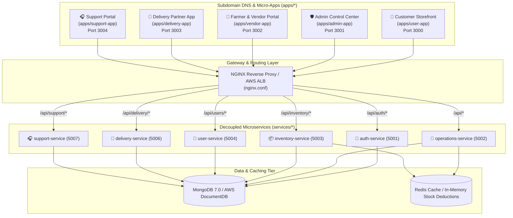
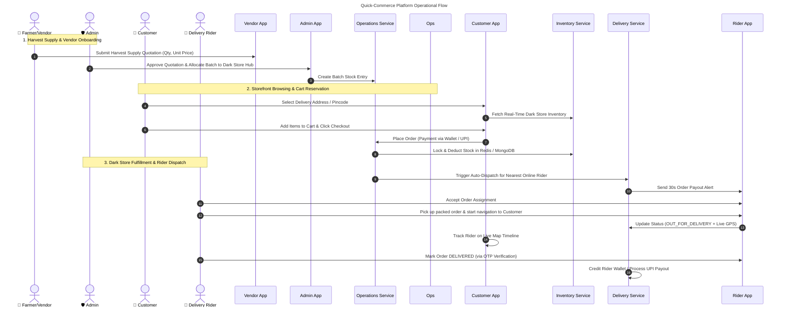

# 🥦 Sunotal Grocery - Architecture & System Flow Documentation

This document outlines the **Frontend Micro-apps**, **Backend Microservices**, **Gateway Topology**, **MIME/Asset Routing**, and the **End-to-End Operational Flow** of the **Sunotal Grocery** quick-commerce platform.

---

## 🏗️ 1. System Architecture Overview

Sunotal Grocery is built as a **decoupled, containerized micro-frontend and microservices architecture**. Requests entering through the gateway ([nginx.conf](file:///home/valivarthi/DIWAKAR/PROJECTS/jcs/sunotal_fullstk/nginx.conf)) are routed to specific frontend subdomains or backend API services.

---

## 🏢 2. Frontend Applications (`apps/`)

| Portal | Subdomain / URL | Entry Point | Persona & Primary Features |
|---|---|---|---|
| 🛒 **Customer Storefront** | `sunotal.automateuniverse.space` | [App.tsx](file:///home/valivarthi/DIWAKAR/PROJECTS/jcs/sunotal_fullstk/apps/user-app/src/App.tsx) | **Customers**: 10-15 Min Express Header, Dark Store selector based on pincode/GPS, category pills, instant Cart drawer, wallet checkout, live order tracking |
| 🛡️ **Admin Control Center** | `admin-sunotal.automateuniverse.space` | [App.tsx](file:///home/valivarthi/DIWAKAR/PROJECTS/jcs/sunotal_fullstk/apps/admin-app/src/App.tsx) | **Super Admins & Hub Managers**: Real-time metrics telemetry, dark store warehouse manager, inventory control, vendor quotation approvals, rider payouts |
| 🌾 **Farmer & Vendor Portal** | `vendor-sunotal.automateuniverse.space` | [App.tsx](file:///home/valivarthi/DIWAKAR/PROJECTS/jcs/sunotal_fullstk/apps/vendor-app/src/App.tsx) | **Farmers & Suppliers**: Onboarding registration, harvest quotation submissions, dark store allocation tracking, Quality Control (QC) status, payout invoices |
| 🛵 **Delivery Partner App** | `delivery-sunotal.automateuniverse.space` | [App.tsx](file:///home/valivarthi/DIWAKAR/PROJECTS/jcs/sunotal_fullstk/apps/delivery-app/src/App.tsx) | **Riders / Delivery Agents**: Duty toggle (`Online`/`Offline`), 30-second order assignment alerts, turn-by-turn navigation, delivery OTP verification, UPI payouts |
| 🎧 **Internal Support Portal** | `support-sunotal.automateuniverse.space` | [App.tsx](file:///home/valivarthi/DIWAKAR/PROJECTS/jcs/sunotal_fullstk/apps/support-app/src/App.tsx) | **Support Agents**: Internal ticket queue management, order issue resolution, SLA timers, escalation handling |

---

## ⚙️ 3. Backend Microservices (`services/`)

Each service is domain-isolated, containerized, and backed by MongoDB (and Redis for caching/inventory counts):

1. **🔑 Auth Service (`auth-service`)** — [index.ts](file:///home/valivarthi/DIWAKAR/PROJECTS/jcs/sunotal_fullstk/services/auth-service/src/index.ts) `[Port 5001]`
   - User registration, login, JWT issuing, role validation (`USER`, `ADMIN`, `VENDOR`, `RIDER`).

2. **🏬 Operations Service (`operations-service`)** — [index.ts](file:///home/valivarthi/DIWAKAR/PROJECTS/jcs/sunotal_fullstk/services/operations-service/src/index.ts) `[Port 5002]`
   - Core orchestrator for catalog, categories, dark store hubs, admin telemetry, vendor quotations, banners, and order placement.

3. **📦 Inventory Service (`inventory-service`)** — [index.ts](file:///home/valivarthi/DIWAKAR/PROJECTS/jcs/sunotal_fullstk/services/inventory-service/src/index.ts) `[Port 5003]`
   - Real-time stock reservation, batch stock deductions per Dark Store, and Redis cache synchronization.

4. **👤 User Service (`user-service`)** — [index.ts](file:///home/valivarthi/DIWAKAR/PROJECTS/jcs/sunotal_fullstk/services/user-service/src/index.ts) `[Port 5004]`
   - Customer profiles, saved delivery addresses, wallet balances, user settings.

5. **🛵 Delivery Service (`delivery-service`)** — [index.ts](file:///home/valivarthi/DIWAKAR/PROJECTS/jcs/sunotal_fullstk/services/delivery-service/src/index.ts) `[Port 5006]`
   - Driver online/offline duty status, order auto-dispatch, live GPS location tracking, rider payouts.

6. **🎧 Support Service (`support-service`)** — [index.ts](file:///home/valivarthi/DIWAKAR/PROJECTS/jcs/sunotal_fullstk/services/support-service/src/index.ts) `[Port 5007]`
   - Customer support tickets, SLA tracking, case assignment, status transitions (`OPEN` → `IN_PROGRESS` → `RESOLVED`).

---

## 🌐 4. NGINX Reverse Proxy & MIME Asset Delivery Architecture

### 4.1 Root Reverse Proxy Gateway (`nginx.conf`)
The root gateway terminates SSL/TLS, inspects incoming `Host` headers, and proxies requests:
- Subdomain requests (e.g. `sunotal.automateuniverse.space`) forward directly to the corresponding app container (`http://sunotal-user-app:80`).
- API requests (e.g. `/api/auth/`, `/api/delivery/`) route directly to the responsible microservice container on ports 5001–5007.

### 4.2 MIME Type Integrity & Asset Protection
- **`include /etc/nginx/mime.types;`**: Included across all app server blocks to serve `.js` (`application/javascript`), `.css` (`text/css`), and `.svg` (`image/svg+xml`) with strict MIME types.
- **No Proxy Interception of Asset 404s**: Root NGINX does **not** use `proxy_intercept_errors on;`. When an asset returns 404 from upstream, NGINX passes the 404 through rather than returning `index.html` (`text/html`), preventing strict MIME blocking (`X-Content-Type-Options: nosniff`) in modern browsers.

---

## 🔄 5. End-to-End Operational Flow

### Detailed Breakdown of the Flow:

1. **Procurement & Supply Inflow (Farmer → Dark Store)**:
   - **Farmers/Vendors** log into the [Farmer & Vendor Portal](file:///home/valivarthi/DIWAKAR/PROJECTS/jcs/sunotal_fullstk/apps/vendor-app/src/App.tsx) to list fresh produce harvest quotations.
   - **Admins** inspect quotations on the [Admin Control Center](file:///home/valivarthi/DIWAKAR/PROJECTS/jcs/sunotal_fullstk/apps/admin-app/src/App.tsx), approve prices, and assign incoming batches to specific **Dark Store Warehouses**.

2. **Catalog & Location-Based Stock Availability**:
   - When a **Customer** opens the [Customer Storefront](file:///home/valivarthi/DIWAKAR/PROJECTS/jcs/sunotal_fullstk/apps/user-app/src/App.tsx), their pincode/location maps them to the serving **Dark Store**.
   - Available stock quantities are checked via `inventory-service` in real-time.

3. **Instant Order Placement & Inventory Locking**:
   - The customer checks out. `operations-service` generates the order while `inventory-service` locks/deducts stock immediately in MongoDB/Redis to avoid double-ordering.

4. **Automated Dispatch & Fulfillment (Dark Store → Delivery Partner)**:
   - `delivery-service` identifies active riders with `Online` status nearby.
   - A 30-second ping alerts the **Delivery Partner** on their [Delivery Partner App](file:///home/valivarthi/DIWAKAR/PROJECTS/jcs/sunotal_fullstk/apps/delivery-app/src/App.tsx).
   - Once accepted, the rider navigates to the Dark Store to pick up the pre-packed bag.

5. **Live Tracking & Delivery Completion**:
   - Customer monitors the delivery live on `LiveOrderTrack.tsx`.
   - Rider inputs the delivery OTP upon arrival. Order completes, triggering instant rider payout updates.

6. **Post-Delivery Support & Issue Resolution**:
   - If an issue arises (e.g., missing item or damaged package), the customer logs a ticket via the [Support Portal](file:///home/valivarthi/DIWAKAR/PROJECTS/jcs/sunotal_fullstk/apps/support-app/src/App.tsx), routed directly to support agents via `support-service`.
