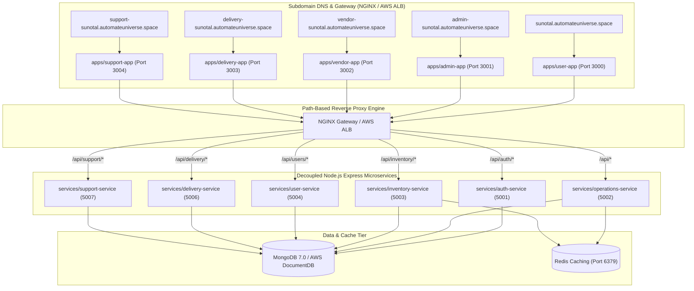

# 🥦 Sunotal Grocery - Decoupled Cloud-Native Quick-Commerce Platform

> **10-15 Minute Hyperlocal Grocery & Fresh Produce Quick-Commerce Ecosystem** built with decoupled, containerized **MERN Microservices** (`services/*`), **Frontend Micro-apps** (`apps/*`), MongoDB Document Database, Redis Caching, NGINX / AWS Application Load Balancer Subdomain & Path Routing, Terraform Infrastructure-as-Code, and Automated GitHub Actions CI/CD Pipelines.

---

## 🌟 Table of Contents
1. [Overview & Application Portals](#-overview--application-portals)
2. [Decoupled Microservices Architecture](#-decoupled-microservices-architecture)
3. [Routing, Reverse Proxy & MIME Type Configuration](#-routing-reverse-proxy--mime-type-configuration)
4. [Environment Variables & Configuration Reference](#-environment-variables--configuration-reference)
5. [CI/CD Pipelines & Deployment Workflow](#-cicd-pipelines--deployment-workflow)
6. [Terraform & AWS Cloud Infrastructure](#-terraform--aws-cloud-infrastructure)
7. [Local Quick Start & Lockfile Management](#-local-quick-start--lockfile-management)
8. [Troubleshooting & Gotchas](#-troubleshooting--gotchas)

---

## 🏢 Overview & Application Portals

Sunotal Grocery is an end-to-end quick-commerce platform consisting of **5 domain-isolated frontend microservice applications** and **6 standalone backend microservices**, connected via an NGINX Gateway (local) or AWS Load Balancer / NGINX reverse proxy (production).

| Portal | URL / Subdomain | Dev Port | Prod Port | Entry Point | Persona & Primary Features | Test Credentials |
|---|---|---|---|---|---|---|
| 🛒 **Customer Storefront** | `sunotal.automateuniverse.space` | `3000` | `80` | [apps/user-app](file:///home/valivarthi/DIWAKAR/PROJECTS/jcs/sunotal_fullstk/apps/user-app) | 10-15 Min Express Header, Dark Store selector based on pincode/GPS, Category Pills, Instant Cart drawer, Wallet checkout, Live Order Timeline | `user@sunotal.com` / `user123` |
| 🛡️ **Admin Control Center** | `admin-sunotal.automateuniverse.space` | `3001` | `80` | [apps/admin-app](file:///home/valivarthi/DIWAKAR/PROJECTS/jcs/sunotal_fullstk/apps/admin-app) | Real-time metrics telemetry, inventory management, dark store hub controls, vendor quotation approvals, rider payouts, system observability | `admin@sunotal.com` / `admin123` |
| 🌾 **Farmer & Vendor Portal** | `vendor-sunotal.automateuniverse.space` | `3002` | `80` | [apps/vendor-app](file:///home/valivarthi/DIWAKAR/PROJECTS/jcs/sunotal_fullstk/apps/vendor-app) | Farmer onboarding registration, harvest supply quotation submissions, Dark Store allocation, QC tracking, HTML payout invoices | `vendor@sunotal.com` / `vendor123` |
| 🛵 **Delivery Partner App** | `delivery-sunotal.automateuniverse.space` | `3003` | `80` | [apps/delivery-app](file:///home/valivarthi/DIWAKAR/PROJECTS/jcs/sunotal_fullstk/apps/delivery-app) | Duty toggle (`Online`/`Offline`), 30s order assignment alerts, Leaflet turn-by-turn navigation, delivery OTP verification, instant UPI payouts | `rider@sunotal.com` / `rider123` |
| 🎧 **Internal Support Portal** | `support-sunotal.automateuniverse.space` | `3004` | `80` | [apps/support-app](file:///home/valivarthi/DIWAKAR/PROJECTS/jcs/sunotal_fullstk/apps/support-app) | Internal ticket queue management, order issue resolution, SLA timers, escalation handling | `admin@sunotal.com` / `admin123` |

---

## ⚙️ Decoupled Microservices Architecture

Each microservice in `services/` is domain-isolated, containerized, and backed by MongoDB (with Redis for caching/inventory counts):

| Microservice | Internal Port | Database / Storage | Primary Code File | Key Endpoint Responsibilities |
|---|---|---|---|---|
| 🔑 **`auth-service`** | `5001` | MongoDB (`users` collection) | [index.ts](file:///home/valivarthi/DIWAKAR/PROJECTS/jcs/sunotal_fullstk/services/auth-service/src/index.ts) | Authentication (`/api/auth/register`, `/api/auth/login`), JWT signing & role validation (`USER`, `ADMIN`, `VENDOR`, `RIDER`) |
| 🏬 **`operations-service`** | `5002` | MongoDB + Redis | [index.ts](file:///home/valivarthi/DIWAKAR/PROJECTS/jcs/sunotal_fullstk/services/operations-service/src/index.ts) | Product catalog, categories, vendor quotations, dark store hubs, admin stats (`/api/admin/*`, `/api/products/*`, `/api/vendors/*`) |
| 📦 **`inventory-service`** | `5003` | MongoDB + Redis | [index.ts](file:///home/valivarthi/DIWAKAR/PROJECTS/jcs/sunotal_fullstk/services/inventory-service/src/index.ts) | Real-time stock reservations and inventory deductions (`/api/inventory/*`) |
| 👤 **`user-service`** | `5004` | MongoDB | [index.ts](file:///home/valivarthi/DIWAKAR/PROJECTS/jcs/sunotal_fullstk/services/user-service/src/index.ts) | Customer user profiles, delivery addresses, and user settings (`/api/users/*`) |
| 🛵 **`delivery-service`** | `5006` | MongoDB | [index.ts](file:///home/valivarthi/DIWAKAR/PROJECTS/jcs/sunotal_fullstk/services/delivery-service/src/index.ts) | Driver status toggle, order dispatch, live GPS tracking, UPI payouts (`/api/delivery/*`) |
| 🎧 **`support-service`** | `5007` | MongoDB | [index.ts](file:///home/valivarthi/DIWAKAR/PROJECTS/jcs/sunotal_fullstk/services/support-service/src/index.ts) | Support ticket creation, case assignment, SLA resolution (`/api/support/*`) |
| ⚡ **`unified-backend`** | `5000` | MongoDB + Redis | [index.ts](file:///home/valivarthi/DIWAKAR/PROJECTS/jcs/sunotal_fullstk/services/unified-backend/src/index.ts) | High-performance monolithic fallback service consolidating all API paths for simplified single-node deployments |



---

## 🔀 Routing, Reverse Proxy & MIME Type Configuration

### 1. NGINX Reverse Proxy Topology (`nginx.conf`)
Root NGINX router ([nginx.conf](file:///home/valivarthi/DIWAKAR/PROJECTS/jcs/sunotal_fullstk/nginx.conf)) handles SSL termination, subdomain routing, and API path forwarding:
- **Subdomain Forwarding**: Proxies subdomains to respective micro-frontend containers (`sunotal-user-app:80`, `sunotal-admin-app:80`, etc.).
- **API Path Forwarding**:
  - `/api/auth/` -> `http://sunotal-auth:5001`
  - `/api/inventory/` -> `http://sunotal-inventory:5003`
  - `/api/users/` -> `http://sunotal-user:5004`
  - `/api/delivery/` -> `http://sunotal-delivery:5006`
  - `/api/support/` -> `http://sunotal-support:5007`
  - `/api/` -> `http://sunotal-operations:5002`

### 2. MIME Types & SPA Routing Safeguards
To prevent assets (JavaScript, CSS, SVG) from failing to load when deployed to AWS:
- **MIME Type Inclusion**: Every app-level NGINX configuration ([apps/user-app/nginx.conf](file:///home/valivarthi/DIWAKAR/PROJECTS/jcs/sunotal_fullstk/apps/user-app/nginx.conf), [apps/unified-frontend/nginx.conf](file:///home/valivarthi/DIWAKAR/PROJECTS/jcs/sunotal_fullstk/apps/unified-frontend/nginx.conf)) includes `/etc/nginx/mime.types;` and `default_type application/octet-stream;`.
- **No SPA 404 Proxy Interception on Assets**: Root NGINX does **NOT** intercept 404 errors with `proxy_intercept_errors on;`. Upstream app containers natively handle SPA route fallback via `try_files $uri $uri/ /index.html;`. This ensures missing or misrouted asset requests return HTTP 404 rather than HTML `index.html`, protecting browsers against strict MIME checking (`X-Content-Type-Options: nosniff`).

---

## 📋 Environment Variables & Configuration Reference

### Backend Microservices Environment Schema

| Variable | Description | Default / Example | Required In |
|---|---|---|---|
| `PORT` | Listening port for service | `5001`, `5002`, `5003`, `5004`, `5006`, `5007` | All Backend Services |
| `NODE_ENV` | Runtime environment | `production` / `development` | All Services |
| `MONGODB_URI` | MongoDB connection string | `mongodb://mongodb:27017/sunotal` | All Backend Services |
| `REDIS_HOST` | Redis cache hostname | `redis` / `127.0.0.1` | Operations & Inventory Services |
| `REDIS_PORT` | Redis cache port | `6379` | Operations & Inventory Services |
| `JWT_SECRET` | Secret key for JWT signing | `sunotal-jwt-secret-key` | Auth & API Gateway Services |
| `AWS_REGION` | Target AWS region | `us-east-1` | AWS Deployments & CI/CD |

---

## 🔄 CI/CD Pipelines & Deployment Workflow

The platform leverages GitHub Actions workflows under [.github/workflows/](file:///home/valivarthi/DIWAKAR/PROJECTS/jcs/sunotal_fullstk/.github/workflows):

1. **`ci.yml` (CI: Build & Test)**:
   - Validates Node.js 20 microservices and Vite frontend builds.
   - Executes `pnpm install --frozen-lockfile` across all packages to enforce exact dependency tree reproducibility.
   - Performs TypeScript compilation checks (`tsc --noEmit`).

2. **`cd-infra.yml` (CD: Infrastructure Provisioning)**:
   - Initializes and applies Terraform configurations under `terraform/`.
   - Provisions Amazon VPC, Security Groups, ECR Repositories, Route53 DNS, and EC2/ECS resources.

3. **`cd-app.yml` (CD: Application & Microservices Deployment)**:
   - Builds multi-stage Docker images for all 6 backend services and 5 frontend apps.
   - Tags container images with git commit SHA (`:${{ github.sha }}`) and `:latest`.
   - Pushes built images to Amazon ECR (`143797622495.dkr.ecr.us-east-1.amazonaws.com`).

---

## 🛠️ Terraform & AWS Cloud Infrastructure

Root Terraform configuration in [terraform/](file:///home/valivarthi/DIWAKAR/PROJECTS/jcs/sunotal_fullstk/terraform) manages AWS infrastructure:

- **State Storage**: Remote S3 backend `s3://jcs-raju-sunotal-final/state/terraform.tfstate` in `us-east-1`.
- **Route53 DNS**: Public Hosted Zone `automateuniverse.space` (`Z002367730D6B17YROB8F`).
- **Amazon ECR Repositories**: 26 container repositories (e.g., `sunotal-auth-service`, `sunotal-user-app`, `sunotal-unified-frontend`).
- **Command Snippets**:
  ```bash
  cd terraform
  terraform init -reconfigure
  terraform plan
  terraform apply -auto-approve
  ```

---

## 🚀 Local Quick Start & Lockfile Management

### 1. Spinning Up Local Microservices Stack
```bash
# Clone repository
git clone https://github.com/valivarthi007/sunotal_fullstk.git
cd sunotal_fullstk

# Launch all microservices, frontend apps, MongoDB, Redis & NGINX gateway
docker-compose up --build
```

### 2. Lockfile Synchronization & Verification
All microservice and app packages use `pnpm` (v9+ / v11+). To ensure Docker builds succeed without `ERR_PNPM_OUTDATED_LOCKFILE`:
```bash
# Update lockfiles across all services and apps
for dir in services/* apps/*; do
  if [ -d "$dir" ] && [ -f "$dir/package.json" ]; then
    (cd "$dir" && pnpm install --no-frozen-lockfile)
  fi
done

# Verify all frozen lockfiles
for dir in services/* apps/*; do
  if [ -d "$dir" ] && [ -f "$dir/package.json" ]; then
    (cd "$dir" && pnpm install --frozen-lockfile)
  fi
done
```

---

## ❓ Troubleshooting & Gotchas

1. **`ERR_PNPM_OUTDATED_LOCKFILE` during Docker Build**:
   - Cause: `package.json` dependencies modified without updating `pnpm-lock.yaml`.
   - Solution: Run `pnpm install --no-frozen-lockfile` inside the component directory and commit the updated `pnpm-lock.yaml`.

2. **CSS / JS Static Assets returning 404 or MIME Type Error on AWS**:
   - Cause: NGINX missing `/etc/nginx/mime.types` or root NGINX proxy intercepting 404s with HTML SPA fallback.
   - Solution: Ensure `include /etc/nginx/mime.types;` is present in app NGINX configs and `proxy_intercept_errors` is disabled on root asset proxy paths.

---

## 📄 License
Licensed under the MIT License.
