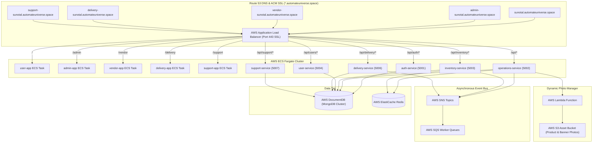

# 🥦 Sunotal Grocery - Decoupled Cloud-Native Quick-Commerce Platform

> **10-15 Minute Hyperlocal Grocery & Fresh Produce Quick-Commerce Ecosystem** built with decoupled, containerized **Microservices**, **Domain Frontends**, AWS RDS PostgreSQL, AWS ElastiCache Redis, Route 53 DNS, ACM Wildcard SSL, AWS Application Load Balancer, AWS ECS Fargate, AWS SQS/SNS Event Bus, AWS Lambda S3 Photo Manager, and Automated GitHub Actions CI/CD Pipelines.

 -brightgreen) 

---

## 🌟 Table of Contents
1. [Overview & Application Portals](#-overview--application-portals)
2. [Decoupled Microservices Architecture](#-decoupled-microservices-architecture)
3. [Subdomain & Path Routing Topology](#-subdomain--path-routing-topology)
4. [Environment Variables & Configuration Reference](#-environment-variables--configuration-reference)
5. [CI/CD Pipelines & Deployment Workflow](#-cicd-pipelines--deployment-workflow)
6. [Terraform & Enterprise AWS Infrastructure](#-terraform--enterprise-aws-infrastructure)
7. [Local Quick Start & Lockfile Management](#-local-quick-start--lockfile-management)
8. [Troubleshooting & Gotchas](#-troubleshooting--gotchas)

---

## 🏢 Overview & Application Portals

Sunotal Grocery is an end-to-end quick-commerce platform consisting of **5 domain-isolated frontend micro-applications** and **6 standalone backend microservices**, connected via an AWS Application Load Balancer (production) or NGINX Gateway (local).

| Portal | URL / Subdomain | Dev Port | Entry Point | Persona & Primary Features | Test Credentials |
|---|---|---|---|---|---|
| 🛒 **Customer Storefront** | `sunotal.automateuniverse.space` | `3000` | [apps/user-app](file:///home/valivarthi/DIWAKAR/PROJECTS/jcs/sunotal_fullstk/apps/user-app) | 10-15 Min Express Header, Dark Store selector based on pincode/GPS, Category Pills, Instant Cart drawer, Wallet checkout, Live Order Timeline | `user@sunotal.com` / `user123` |
| 🛡️ **Admin Control Center** | `admin-sunotal.automateuniverse.space` | `3001` | [apps/admin-app](file:///home/valivarthi/DIWAKAR/PROJECTS/jcs/sunotal_fullstk/apps/admin-app) | Real-time metrics telemetry, inventory management, dark store hub controls, vendor quotation approvals, rider payouts, system observability | `admin@sunotal.com` / `admin123` |
| 🌾 **Farmer & Vendor Portal** | `vendor-sunotal.automateuniverse.space` | `3002` | [apps/vendor-app](file:///home/valivarthi/DIWAKAR/PROJECTS/jcs/sunotal_fullstk/apps/vendor-app) | Farmer onboarding registration, harvest supply quotation submissions, Dark Store allocation, QC tracking, HTML payout invoices | `vendor@sunotal.com` / `vendor123` |
| 🛵 **Delivery Partner App** | `delivery-sunotal.automateuniverse.space` | `3003` | [apps/delivery-app](file:///home/valivarthi/DIWAKAR/PROJECTS/jcs/sunotal_fullstk/apps/delivery-app) | Duty toggle (`Online`/`Offline`), 30s order assignment alerts, Leaflet turn-by-turn navigation, delivery OTP verification, instant UPI payouts | `rider@sunotal.com` / `rider123` |
| 🎧 **Internal Support Portal** | `support-sunotal.automateuniverse.space` | `3004` | [apps/support-app](file:///home/valivarthi/DIWAKAR/PROJECTS/jcs/sunotal_fullstk/apps/support-app) | Internal ticket queue management, order issue resolution, SLA timers, escalation handling | `admin@sunotal.com` / `admin123` |

---

## ⚙️ Decoupled Microservices Architecture

Each microservice in `services/` is domain-isolated, containerized, and backed by MongoDB (with Redis for caching/inventory counts):

| Microservice | Port | Database / Storage | Primary Code File | Key Endpoint Responsibilities |
|---|---|---|---|---|
| 🔑 **`auth-service`** | `5001` | AWS DocumentDB (`users` collection) | [index.ts](file:///home/valivarthi/DIWAKAR/PROJECTS/jcs/sunotal_fullstk/services/auth-service/src/index.ts) | Authentication (`/api/auth/register`, `/api/auth/login`), JWT signing & role validation (`USER`, `ADMIN`, `VENDOR`, `RIDER`) |
| 🏬 **`operations-service`** | `5002` | DocumentDB + ElastiCache Redis | [index.ts](file:///home/valivarthi/DIWAKAR/PROJECTS/jcs/sunotal_fullstk/services/operations-service/src/index.ts) | Product catalog, categories, vendor quotations, dark store hubs, admin stats (`/api/admin/*`, `/api/products/*`, `/api/vendors/*`) |
| 📦 **`inventory-service`** | `5003` | DocumentDB + ElastiCache Redis | [index.ts](file:///home/valivarthi/DIWAKAR/PROJECTS/jcs/sunotal_fullstk/services/inventory-service/src/index.ts) | Real-time stock reservations and inventory deductions (`/api/inventory/*`) |
| 👤 **`user-service`** | `5004` | AWS DocumentDB | [index.ts](file:///home/valivarthi/DIWAKAR/PROJECTS/jcs/sunotal_fullstk/services/user-service/src/index.ts) | Customer user profiles, delivery addresses, and user settings (`/api/users/*`) |
| 🛵 **`delivery-service`** | `5006` | AWS DocumentDB | [index.ts](file:///home/valivarthi/DIWAKAR/PROJECTS/jcs/sunotal_fullstk/services/delivery-service/src/index.ts) | Driver status toggle, order dispatch, live GPS tracking, UPI payouts (`/api/delivery/*`) |
| 🎧 **`support-service`** | `5007` | AWS DocumentDB | [index.ts](file:///home/valivarthi/DIWAKAR/PROJECTS/jcs/sunotal_fullstk/services/support-service/src/index.ts) | Support ticket creation, case assignment, SLA resolution (`/api/support/*`) |



---

## 🔀 Subdomain & Path Routing Topology

All subdomains map to the Application Load Balancer via Route 53 A-records:
- `sunotal.automateuniverse.space`
- `admin-sunotal.automateuniverse.space`
- `vendor-sunotal.automateuniverse.space`
- `delivery-sunotal.automateuniverse.space`
- `support-sunotal.automateuniverse.space`

### Path Fallback & MIME Type Security
- NGINX configurations ([apps/unified-frontend/nginx.conf](file:///home/valivarthi/DIWAKAR/PROJECTS/jcs/sunotal_fullstk/apps/unified-frontend/nginx.conf), [nginx.conf](file:///home/valivarthi/DIWAKAR/PROJECTS/jcs/sunotal_fullstk/nginx.conf)) support both subdomains and IP subpaths (`/admin`, `/vendor`, `/delivery`, `/support`).
- Includes `/etc/nginx/mime.types` and sets `chmod 755` permissions across build outputs to ensure JavaScript (`application/javascript`) and CSS (`text/css`) render without `X-Content-Type-Options: nosniff` blocking.

---

## 🛠️ Terraform & Enterprise AWS Infrastructure

Root Terraform configuration in [terraform/](file:///home/valivarthi/DIWAKAR/PROJECTS/jcs/sunotal_fullstk/terraform) manages AWS infrastructure:

- **State Storage**: Remote S3 backend `s3://jcs-raju-sunotal-final/state/terraform.tfstate` in `us-east-1`.
- **Core Modules**:
  - `vpc`: Multi-AZ VPC and subnets
  - `security`: ALB, ECS task, DocumentDB, ElastiCache Redis, SQS/SNS, and Lambda Security Groups
  - `iam`: ECS task execution role, task role, ACM validation, Secrets Manager policy, and Lambda execution roles
  - `ecr`: Amazon ECR container repositories
  - `database`: AWS DocumentDB cluster (MongoDB) + AWS ElastiCache for Redis cluster
  - `sqs_sns`: AWS SNS Topics & SQS Queues for event-driven messaging
  - `lambda`: AWS S3 Bucket + Lambda Function for dynamic product & banner photo management
  - `ecs`: AWS ECS Fargate Cluster, Task Definitions, ALB (with ACM Certificate & Port 443 Listener), Target Groups, Listener Rules, and ECS Services
  - `route53`: Route 53 Alias A-records for subdomains mapping to ALB DNS name

---

## 🚀 Local Quick Start & Lockfile Management

```bash
# Clone repository
git clone https://github.com/valivarthi007/sunotal_fullstk.git
cd sunotal_fullstk

# Verify all frozen lockfiles
for dir in services/* apps/*; do
  if [ -d "$dir" ] && [ -f "$dir/package.json" ]; then
    (cd "$dir" && pnpm install --frozen-lockfile)
  fi
done

# Launch local stack via Docker Compose
docker-compose up --build
```

---

## 📄 License
Licensed under the MIT License.
