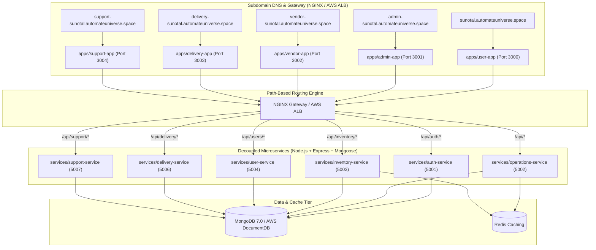

# 🥦 Sunotal Grocery - Decoupled Cloud-Native Quick-Commerce Platform

> **10-15 Minute Hyperlocal Grocery & Fresh Produce Quick-Commerce Ecosystem** built with decoupled, containerized **MERN Microservices** (`services/*`) and **Frontend Micro-apps** (`apps/*`), MongoDB Document Database, Redis Caching, NGINX / AWS Load Balancer Subdomain & Path Routing, and Automated GitHub Actions CI/CD Pipelines.

---

## 🌟 Overview & System Portals

Sunotal Grocery is an end-to-end quick-commerce platform consisting of **5 domain-isolated frontend microservice applications** and **6 standalone backend microservices**, connected via an NGINX Gateway (local) or AWS Application Load Balancer (production).

### 🏢 Subdomain-Isolated Applications (`apps/`):

| Portal | URL / Subdomain | Port | Persona & Primary Features | Test Credentials |
|---|---|---|---|---|
| 🛒 **Customer Storefront** | `sunotal.automateuniverse.space` | `3000` / `80` | 10-15 Min Express Header, Dark Store selector, Category Pills, Instant Cart drawer, Real-Time Order Timeline & Live Delivery Tracker | `user@sunotal.com` / `user123` |
| 🛡️ **Admin Control Center** | `admin-sunotal.automateuniverse.space` | `3001` / `80` | Metrics telemetry, inventory management, dark store hub controls, vendor quotation approvals, financial ledger | `admin@sunotal.com` / `admin123` |
| 🌾 **Farmer & Vendor Portal** | `vendor-sunotal.automateuniverse.space` | `3002` / `80` | Farmer onboarding, harvest supply quotation submissions, Dark Store allocation, QC tracking, HTML payout invoices | `vendor@sunotal.com` / `vendor123` |
| 🛵 **Delivery Partner App** | `delivery-sunotal.automateuniverse.space` | `3003` / `80` | Duty toggle (`Online`/`Offline`), 30s order alerts, Leaflet turn-by-turn navigation, instant UPI payouts | `rider@sunotal.com` / `rider123` |
| 🎧 **Internal Support Portal** | `support-sunotal.automateuniverse.space` | `3004` / `80` | Internal ticket management and SLA resolution with Admin Auth Guard | `admin@sunotal.com` / `admin123` |

---

## ⚙️ Decoupled Backend Microservices (`services/`):

| Microservice | Port | Database / Storage | Key Endpoint Responsibilities |
|---|---|---|---|
| 🔑 **`auth-service`** | `5001` | MongoDB (`User` collection) | Authentication (`/api/auth/register`, `/api/auth/login`), JWT validation |
| 🏬 **`operations-service`** | `5002` | MongoDB + Redis | Product catalog, categories, vendor quotations, dark store hubs, admin stats (`/api/admin/*`, `/api/products/*`, `/api/vendors/*`) |
| 📦 **`inventory-service`** | `5003` | MongoDB + Redis | Real-time stock reservations and inventory deductions (`/api/inventory/*`) |
| 👤 **`user-service`** | `5004` | MongoDB | Customer user profiles, delivery addresses, and user settings (`/api/users/*`) |
| 🛵 **`delivery-service`** | `5006` | MongoDB | Driver status toggle, order dispatch, live GPS tracking, UPI payouts (`/api/delivery/*`) |
| 🎧 **`support-service`** | `5007` | MongoDB | Support ticket creation, case assignment, SLA resolution (`/api/support/*`) |

---

## 🏗️ Architecture & Routing



---

## 🔄 CI/CD Pipelines & Infrastructure Reset Policy

1. **`infra.yml` (Infrastructure Automation)**:
   - Triggered on changes to `terraform/**`, `k8s/**`, or `docker-compose*.yml`.
   - Runs `infra-destroy` teardown followed by `infra-apply` to guarantee clean infrastructure resets.
2. **`ci.yml` (Microservices CI Pipeline)**:
   - Triggered on changes to `services/**`, `apps/**`, or upon successful `infra.yml` completion.
   - Builds independent TypeScript microservices and pushes ECR container images.
3. **`cd.yml` (Deployment Pipeline)**:
   - Auto-detects target platform (AWS ECS Fargate or AWS EKS) and deploys all 11 microservice apps.

---

## 🚀 Local Quick Start (Docker Compose)

```bash
# 1. Clone repository
git clone https://github.com/valivarthi007/sunotal_fullstk.git
cd sunotal_fullstk

# 2. Spin up full microservices stack with local NGINX router
docker-compose up --build
```

Access local portals:
- Consumer Storefront: `http://localhost:3000` (or `http://sunotal.automateuniverse.space` via local hosts file)
- Admin Center: `http://localhost:3001`
- Vendor Portal: `http://localhost:3002`
- Delivery App: `http://localhost:3003`
- Support Portal: `http://localhost:3004`

---

## 📄 License
Licensed under the MIT License.

