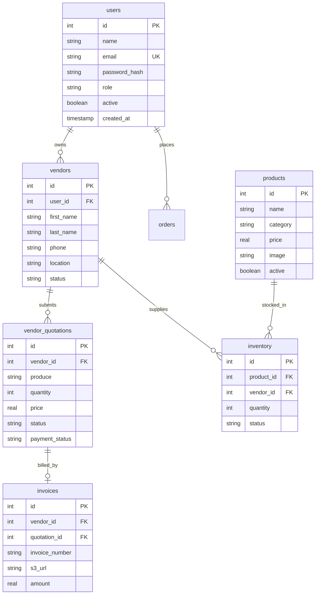

# 01. Application Code Architecture, Beginner Operating Manual & Full-Stack Guide

Welcome to the **Sunotal Application Code Master Guide**. This guide is written so that **anyone—from a complete beginner to a senior engineer—can understand, run, modify, and extend the Sunotal full-stack codebase**.

---

## 📖 Table of Contents
1. [Full-Stack Architecture Overview](#1-full-stack-architecture-overview)
2. [Tech Stack & Tooling Deep Dive](#2-tech-stack--tooling-deep-dive)
3. [Beginner Operating Manual by User Role](#3-beginner-operating-manual-by-user-role)
4. [Microservices Breakdown & Codebase Organization](#4-microservices-breakdown--codebase-organization)
5. [End-to-End API Interaction Workflow](#5-end-to-end-api-interaction-workflow)
6. [Database Schema, ER Diagram & SQL Masterclass](#6-database-schema-er-diagram--sql-masterclass)
7. [Step-by-Step Beginner Local Setup Guide](#7-step-by-step-beginner-local-setup-guide)
8. [API Health Querying & Testing Guide (cURL & Wget)](#8-api-health-querying--testing-guide-curl--wget)
9. [Application Troubleshooting & Diagnostics Runbook](#9-application-troubleshooting--diagnostics-runbook)
10. [Feature Enhancement Guide: Razorpay Payment Gateway Integration](#10-feature-enhancement-guide-razorpay-payment-gateway-integration)

---

## 1. Full-Stack Architecture Overview

Sunotal is an enterprise multi-tenant B2B and B2C agricultural marketplace connecting Indian farmers (vendors) directly with retail consumers and commercial buyers.

```
┌─────────────────────────────────────────────────────────────────────────────────┐
│                              CLIENT / USER BROWSER                              │
│                    React 18 + Vite SPA (Port 3000 / Port 80)                     │
└────────────────────────────────────────┬────────────────────────────────────────┘
                                         │ HTTPS / JSON
                                         ▼
┌─────────────────────────────────────────────────────────────────────────────────┐
│              AWS APPLICATION LOAD BALANCER / NGINX REVERSE PROXY              │
└──────┬──────────────────┬───────────────────┬───────────────────┬───────────────┘
       │ /api/auth        │ /api/operations   │ /api/inventory    │ /api/users
       │                  │ /api/banners      │ /api/orders       │ /api/vendors
       │                  │ /api/products     │                   │ /api/admin
       ▼                  ▼                   ▼                   ▼
┌──────────────┐   ┌──────────────┐    ┌──────────────┐    ┌──────────────┐
│ Auth Service │   │ Operations   │    │ Inventory    │    │ User Service │
│ (Port 5001)  │   │ Service      │    │ Service      │    │ (Port 5004)  │
│              │   │ (Port 5002)  │    │ (Port 5003)  │    │              │
└──────┬───────┘   └──────┬───────┘    └──────┬───────┘    └──────┬───────┘
       │                  │                   │                   │
       └──────────────────┴─────────┬─────────┴───────────────────┘
                                    │ SQL Queries (Drizzle ORM)
                                    ▼
                     ┌─────────────────────────────┐
                     │ AWS RDS PostgreSQL Database │
                     │   (Port 5432 / DB: sunotal) │
                     └─────────────────────────────┘
```

---

## 2. Tech Stack & Tooling Deep Dive

### Frontend Stack
- **React 18**: Modern UI library utilizing functional components and hooks (`useState`, `useEffect`, `useContext`).
- **TypeScript**: Ensures type safety across components, props, and API response objects.
- **Vite**: Ultra-fast build tool and development server with Hot Module Replacement (HMR).
- **Tailwind CSS**: Utility-first CSS framework for responsive UI design.
- **Wouter**: Lightweight client-side router for single-page application navigation.
- **TanStack Query (React Query)**: Manages API fetching, caching, background polling, and optimistic UI updates.
- **Lucide React**: Modern icon set for UI elements.

### Backend Stack
- **Node.js (v20 LTS)**: High-performance asynchronous JavaScript runtime.
- **Express.js (v5)**: Fast, unopinionated web framework for Node.js.
- **Drizzle ORM**: Type-safe TypeScript ORM providing high-performance SQL generation without heavy runtime overhead.
- **PostgreSQL (v16)**: Production-grade relational database management system (RDBMS).
- **Zod**: TypeScript-first schema declaration and data validation library.
- **JSON Web Tokens (JWT)**: Stateless user session authentication using signed JWT tokens stored in `localStorage` or Authorization headers.
- **Bcrypt.js**: One-way salt hashing algorithm for user passwords (`bcrypt.hash(password, 10)`).
- **AWS SDK v3 (`@aws-sdk/client-s3`)**: Programmatic upload of farmer invoices and produce photos to AWS S3 storage.

---

## 3. Beginner Operating Manual by User Role

The application supports three distinct user roles: **Customer/User**, **Farmer/Vendor**, and **Administrator**.

### Role 1: Customer / Retail User (`/`)

#### 1. Registration & Login
- Click **Login / Register** in the top navigation bar.
- To create an account, click **Register**, fill in your full name, email address, password, phone number, and city, then click **Create Account**.
- Once registered, a JWT token is stored in your browser session, logging you in automatically.

#### 2. Browsing Farm Produce
- **Homepage (`/`)**: View season promotional banners, main crop categories (Vegetables, Fruits, Grains, Dairy, Herbs & Spices), and featured organic produce.
- **Product Catalog (`/products`)**: Filter produce by category, search by crop name in real-time, or toggle the **Organic Only** checkbox.

#### 3. Cart Management & Checkout (`/cart`)
- Click **Add to Cart** on any produce card.
- Open the Shopping Cart by clicking the cart icon in the header.
- Adjust item quantities (`+` / `-`) or remove items.
- Click **Proceed to Checkout**, enter your shipping delivery address, and click **Place Order**.
- Track your order status under **My Orders (`/orders`)**.

---

### Role 2: Farmer / Vendor Portal (`/vendor`)

#### 1. Vendor Application (`/vendor/register`)
- Registered users can apply to become verified farmers by navigating to `/vendor/register`.
- Fill in:
  - **First Name & Last Name**
  - **Phone Number & Farm Location** (e.g. Telangana, Maharashtra)
  - **Farm Size** (e.g. 5 Acres, 10 Hectares)
  - **Produce Specialty** (e.g. Organic Vegetables)
  - **Aadhar Number** (12-digit Government ID)
  - **GSTIN** (Optional Tax ID)
- Click **Submit Application**. Application status is set to `pending` until reviewed by an Admin.

#### 2. Vendor Dashboard (`/vendor`)
- Once approved, farmers gain access to the **Vendor Dashboard**:
  - View overall earnings and approved quotations.
  - Submit new price quotes for harvested produce.

#### 3. Submitting Price Quotations (`/vendor/quotations/new`)
- Farmers submit harvest offers to Sunotal by specifying:
  - **Produce Name** (e.g. Organic Tomatoes)
  - **Category** (e.g. Vegetables)
  - **Harvest Quantity** (in kg)
  - **Quotation Price per kg** (in INR ₹)
  - **Aadhar Number** for verification
- Click **Submit Quotation**.

---

### Role 3: Administrator Control Panel (`/admin`)

#### 1. Admin Login
- Access `/admin/login` or click **Admin Login**.
- Default Credentials:
  - **Email**: `admin@sunotal.com`
  - **Password**: `admin123`

#### 2. Executive Dashboard (`/admin`)
- Real-time aggregate metric cards:
  - **Total Revenue**: Sum of all processed orders and vendor transactions.
  - **Total Active Products**: Total published crop listings.
  - **Registered Farmers**: Total onboarding vendor applications.
  - **Category Distribution**: Breakdown chart of produce categories.

#### 3. Vendor Application Approvals (`/admin/vendors`)
- Review pending farmer applications.
- Click **Approve Vendor** to verify farmer credentials and grant vendor portal access, or click **Reject**.

#### 4. Farmer Quotation Processing (`/admin/quotations`)
- View incoming harvest quotes submitted by Indian farmers.
- **Accept Quote**: Click **Accept**. Sunotal automatically adds the harvested produce quantity directly into active public inventory and creates a draft product listing if it is a new crop.
- **Generate Invoice**: Click **Generate Invoice**. Sunotal builds an official PDF invoice, uploads it to AWS S3 (`jcs-raju-sunotal-final`), and attaches the S3 invoice URL to the quotation record.
- **Process Payout**: Click **Mark as Paid** after dispatching payment to the farmer's bank account.

---

## 4. Microservices Breakdown & Codebase Organization

```
sunotal_fullstk/
├── frontend/                       # React 18 SPA Frontend
│   ├── src/
│   │   ├── components/            # Reusable UI Components (Navbar, Footer, ProductCard)
│   │   ├── pages/                 # Page Views
│   │   │   ├── admin/             # Admin Dashboard, Vendors, Quotations, Products
│   │   │   ├── vendor/            # Farmer Dashboard, Register, Quotations
│   │   │   ├── Home.tsx           # Customer Homepage
│   │   │   ├── Products.tsx       # Crop Catalog
│   │   │   ├── Cart.tsx           # Shopping Cart & Checkout
│   │   │   └── Login.tsx          # Authentication Form
│   │   ├── lib/                   # API Client, State Management & Context
│   │   └── App.tsx                # Main Routing Configuration
│   └── vite.config.ts             # Vite Build Configuration
│
└── backend/                        # Node.js Express Backend
    ├── services/
    │   ├── auth-service/          # Microservice 1: Authentication & Users (Port 5001)
    │   ├── operations-service/    # Microservice 2: Categories, Banners & S3 Uploads (Port 5002)
    │   ├── inventory-service/     # Microservice 3: Products, Inventory & Orders (Port 5003)
    │   └── user-service/          # Microservice 4: User Profiles, Vendors, Invoices & Admin Stats (Port 5004)
    └── src/                       # Monolith Express Server (Port 5000)
```

---

## 5. End-to-End API Interaction Workflow

```
[ Customer ] ──> POST /api/auth/login ──> [ Auth Service :5001 ]
                      │
                      ├── Verifies bcrypt password against RDS `users` table
                      └── Returns Signed JWT Token { userId: 1, role: "admin" }

[ Customer ] ──> GET /api/products ──> [ Operations/Inventory Service :5003 ]
                      │
                      └── Queries RDS `products` table where active = true

[ Farmer ]   ──> POST /api/vendors/quotations ──> [ User Service :5004 ]
                      │
                      ├── Validates Bearer JWT Token
                      └── Inserts quote record into `vendor_quotations` table (status: "pending")

[ Admin ]    ──> PUT /api/admin/quotations/1/status ──> [ User Service :5004 ]
                      │
                      ├── Updates status = "accepted" in `vendor_quotations` table
                      ├── Checks or creates draft product in `products` table
                      └── Inserts stock entry into `inventory` table (status: "in_stock")
```

---

## 6. Database Schema, ER Diagram & SQL Masterclass

### ER Diagram



### SQL Masterclass: Manual Database Operations

```sql
-- 1. Create database manually if executing outside Drizzle
CREATE DATABASE sunotal;

-- 2. List all users and roles
SELECT id, name, email, role, active, created_at FROM users ORDER BY id ASC;

-- 3. Update user role to Admin
UPDATE users SET role = 'admin', active = true WHERE email = 'user@sunotal.com';

-- 4. View all farmer vendor applications
SELECT id, user_id, first_name || ' ' || last_name AS full_name, produce, location, status FROM vendors;

-- 5. Approve a pending farmer application
UPDATE vendors SET status = 'approved' WHERE id = 1;

-- 6. Inspect submitted farmer price quotations
SELECT q.id, v.first_name || ' ' || v.last_name AS farmer_name, q.produce, q.quantity, q.price, q.status, q.payment_status
FROM vendor_quotations q
JOIN vendors v ON q.vendor_id = v.id;

-- 7. Manually accept quotation #1
UPDATE vendor_quotations SET status = 'accepted' WHERE id = 1;

-- 8. View stock levels per product
SELECT p.name AS product_name, p.category, SUM(i.quantity) AS stock_quantity, i.status
FROM inventory i
JOIN products p ON i.product_id = p.id
GROUP BY p.name, p.category, i.status;
```

---

## 7. Step-by-Step Beginner Local Setup Guide

Follow these exact commands to run the complete Sunotal application on your local machine:

### Step 1: Install System Prerequisites
- Install **Node.js v20**: [nodejs.org](https://nodejs.org)
- Install **pnpm v9**: `npm install -g pnpm`
- Install **Docker Desktop**: [docker.com](https://www.docker.com)

### Step 2: Clone Codebase & Install Workspace Dependencies
```bash
git clone https://github.com/valivarthi007/sunotal_fullstk.git
cd sunotal_fullstk
pnpm install
```

### Step 3: Run Automated Setup Script
```bash
# Executable script installs packages, starts Postgres container, runs migrations & seeds database
./setup.sh
```

### Step 4: Start Local Development Servers
```bash
./start-dev.sh
```

Open your browser to:
- **Frontend App**: `http://localhost:3000`
- **Backend API**: `http://localhost:5000/api/healthz`
- **Admin Login**: `http://localhost:3000/admin/login` (`admin@sunotal.com` / `admin123`)

---

## 8. API Health Querying & Testing Guide (cURL & Wget)

```bash
# 1. Test Production Homepage HTML
curl -i https://sunotal.automateuniverse.space/
wget -qO- https://sunotal.automateuniverse.space/ | grep "<title>"

# 2. Test Microservices Health Check Endpoint
curl -i https://sunotal.automateuniverse.space/api/healthz

# 3. Test Admin Authentication & Obtain JWT Token
LOGIN_JSON=$(curl -s -X POST https://sunotal.automateuniverse.space/api/auth/login \
  -H "Content-Type: application/json" \
  -d '{"email":"admin@sunotal.com","password":"admin123"}')

echo "$LOGIN_JSON"

TOKEN=$(echo "$LOGIN_JSON" | grep -o '"token":"[^"]*' | cut -d'"' -f4)

# 4. Test Authenticated Admin Stats API Endpoint
curl -i -H "Authorization: Bearer $TOKEN" https://sunotal.automateuniverse.space/api/admin/stats

# 5. Test Authenticated Admin Quotations API Endpoint
curl -i -H "Authorization: Bearer $TOKEN" https://sunotal.automateuniverse.space/api/admin/quotations
```

---

## 9. Application Troubleshooting & Diagnostics Runbook

| Symptom | Probable Cause | Diagnostic Command | Solution |
| :--- | :--- | :--- | :--- |
| **503 Service Temporarily Unavailable** | EKS Pod IP addresses not registered in ALB Target Groups or Security Group rule blocking traffic. | `aws elbv2 describe-target-health --target-group-arn <ARN>` | Add SG ingress rule (`sg-049a325dedf54e9e3` -> `sg-0f50d6c770735f855`) and register pod IPs via AWS CLI. |
| **500 Internal Server Error on Login** | Invalid database hostname in Secret `sunotal-secrets`. | `kubectl logs deployment/sunotal-auth -n sunotal` | Update `DATABASE_URL` host in `k8s/01-configmap-secret.yaml` to `sunotal-postgres.cs1gq0a2wtpu.us-east-1.rds.amazonaws.com` and run `kubectl rollout restart deployment -n sunotal`. |
| **Blank White Screen on `/admin/products`** | Client-side API fetch failure due to missing backend route fallback. | Inspect browser DevTools Console (`F12` -> Network tab). | Verify ALB listener routing rules for `/api/products` and `/api/product-definitions`. |

---

## 10. Feature Enhancement Guide: Razorpay Payment Gateway Integration

To add real-time online payment processing via Razorpay to `backend/services/inventory-service/src/routes/orders.ts`:

### Step 1: Install Razorpay SDK
```bash
cd backend/services/inventory-service
pnpm add razorpay
```

### Step 2: Implement Order Creation Route in `src/routes/orders.ts`

```typescript
import { Router } from "express";
import Razorpay from "razorpay";
import { requireAuth } from "../lib/auth.js";

const router = Router();

const razorpay = new Razorpay({
  key_id: process.env.RAZORPAY_KEY_ID || "rzp_test_sample",
  key_secret: process.env.RAZORPAY_KEY_SECRET || "sample_secret_key",
});

// POST /api/orders/razorpay-order
router.post("/orders/razorpay-order", requireAuth, async (req, res) => {
  const { totalAmount } = req.body; // Total order amount in INR

  try {
    const options = {
      amount: Math.round(totalAmount * 100), // Amount in paise (1 INR = 100 paise)
      currency: "INR",
      receipt: `receipt_order_${Date.now()}`,
    };

    const razorpayOrder = await razorpay.orders.create(options);
    res.json({
      orderId: razorpayOrder.id,
      currency: razorpayOrder.currency,
      amount: razorpayOrder.amount,
    });
  } catch (error: any) {
    console.error("Razorpay order creation failed:", error);
    res.status(500).json({ error: "Failed to create payment order" });
  }
});

export default router;
```

### Step 3: Frontend Checkout Integration (`frontend/src/pages/Cart.tsx`)

```tsx
// Load Razorpay Checkout SDK Script
const loadRazorpayScript = () => {
  return new Promise((resolve) => {
    const script = document.createElement("script");
    script.src = "https://checkout.razorpay.com/v1/checkout.js";
    script.onload = () => resolve(true);
    script.onerror = () => resolve(false);
    document.body.appendChild(script);
  });
};

const handlePayment = async () => {
  const res = await loadRazorpayScript();
  if (!res) {
    alert("Razorpay SDK failed to load. Check your internet connection.");
    return;
  }

  // Create order on backend
  const orderData = await apiRequest("POST", "/api/orders/razorpay-order", { totalAmount: 450 });

  const options = {
    key: "rzp_test_sample",
    amount: orderData.amount,
    currency: orderData.currency,
    name: "Sunotal Farms",
    description: "Farm-Fresh Produce Order",
    order_id: orderData.orderId,
    handler: function (response: any) {
      alert(`Payment Successful! Payment ID: ${response.razorpay_payment_id}`);
    },
    prefill: {
      name: "Customer Name",
      email: "user@sunotal.com",
      contact: "+91 98765 11111",
    },
  };

  const paymentObject = new (window as any).Razorpay(options);
  paymentObject.open();
};
```
