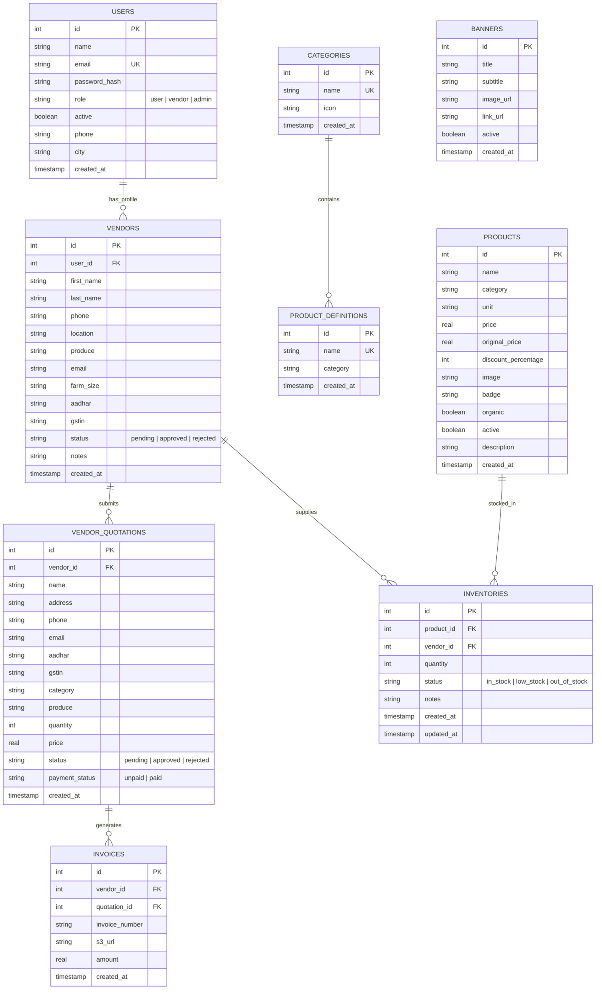

# Chapter 2: System Architecture & Database Schemas

## 1. System Architecture Topology

The following diagram illustrates how user requests travel through AWS infrastructure, the Application Load Balancer (ALB), Kubernetes (EKS), Microservices, Database, and Object Storage:

```mermaid
graph TD
    Client["🌐 End User (Browser/Mobile)\nhttps://sunotal.automateuniverse.space"] --> Route53["DNS: AWS Route53"]
    Route53 --> ALB["AWS Application Load Balancer (ALB)\nListener 80 (HTTP 301) / Listener 443 (HTTPS)"]

    subgraph AWS VPC (Virtual Private Cloud)
        subgraph Public Subnets
            ALB
        end

        subgraph Private Subnets (EKS Cluster: sunotal-cluster)
            Frontend["Frontend Pod\n(Nginx + React App)"]
            AuthSvc["Auth Service Pod\n(Port 5001)"]
            OpsSvc["Operations Service Pod\n(Port 5002)"]
            InvSvc["Inventory Service Pod\n(Port 5003)"]
            UserSvc["User Service Pod\n(Port 5004)"]
        end

        subgraph Private Database Subnets
            RDS[("AWS RDS PostgreSQL\nsunotal-postgres:5432")]
        end
    end

    subgraph AWS Cloud Storage & CDN
        CloudFront["AWS CloudFront CDN"]
        S3["AWS S3 Bucket\n(Product Assets & Invoices)"]
    end

    ALB -->|/| Frontend
    ALB -->|/api/auth| AuthSvc
    ALB -->|/api/products, /api/banners| OpsSvc
    ALB -->|/api/inventory, /api/orders| InvSvc
    ALB -->|/api/users, /api/vendors, /api/admin| UserSvc

    AuthSvc --> RDS
    OpsSvc --> RDS
    InvSvc --> RDS
    UserSvc --> RDS

    OpsSvc --> S3
    UserSvc --> S3
    CloudFront --> S3
```

---

## 2. Microservices Breakdown & API Routes

Traffic arriving at the Application Load Balancer (or Nginx Ingress) is routed to specific microservices based on path prefixes:

### A. Auth Service (`/api/auth`) — Port 5001
- `POST /api/auth/register`: User registration (Customer, Farmer/Vendor).
- `POST /api/auth/login`: User login, returns signed JWT token.
- `GET /api/auth/me`: Decodes JWT token and returns current session details.
- `GET /api/healthz`: Service health check.

### B. Operations Service (`/api/operations`, `/api/products`, `/api/banners`, `/api/upload`) — Port 5002
- `GET /api/products`: List active products with filtering by category, search, and organic flags.
- `POST /api/products`: Create a new product (Admin only).
- `PUT /api/products/:id`: Update product details.
- `DELETE /api/products/:id`: Soft delete or remove product.
- `GET /api/banners`: List active promotional banners for the home page.
- `POST /api/upload`: Upload product image or banner image to S3 bucket.

### C. Inventory Service (`/api/inventory`, `/api/orders`, `/api/product-definitions`) — Port 5003
- `GET /api/inventory`: List current stock levels across vendors.
- `POST /api/inventory`: Update or add stock for a specific product and vendor.
- `GET /api/orders`: List orders for buyer or vendor.
- `POST /api/orders`: Place a new purchase order.
- `GET /api/product-definitions`: List master product catalog names (e.g. Desi Tomato, Alphonso Mango).

### D. User Service (`/api/users`, `/api/vendors`, `/api/admin`) — Port 5004
- `GET /api/users`: Manage user accounts.
- `POST /api/vendors`: Submit vendor application.
- `GET /api/vendors`: List vendor applications and statuses (pending/approved).
- `POST /api/vendors/quotations`: Vendor submits price quotation for produce.
- `GET /api/admin/stats`: Get dashboard KPIs (total sales, active vendors, orders count).
- `GET /api/admin/quotations`: Admin reviews and approves farmer quotations, triggering PDF invoice generation and S3 upload.

---

## 3. Complete Database Schema (PostgreSQL & Drizzle ORM)

Sunotal uses 8 relational tables defined in TypeScript schema (`src/schema/index.ts`):


