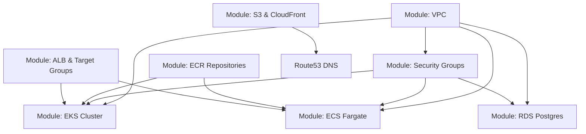

# 04. Terraform (IaC) & AWS Infrastructure Provisioning Masterclass

Welcome to the **Sunotal Terraform Infrastructure as Code (IaC) Master Guide**. This document provides an exhaustive, educational, and operational manual for provisioning, managing, and troubleshooting AWS cloud infrastructure using Terraform and the AWS CLI.

---

## 📖 Table of Contents
1. [Infrastructure as Code (IaC) 101 for Beginners](#1-infrastructure-as-code-iac-101-for-beginners)
2. [Terraform Directory Structure & Module Breakdown](#2-terraform-directory-structure--module-breakdown)
3. [Exhaustive Terraform Module Specifications](#3-exhaustive-terraform-module-specifications)
4. [Step-by-Step Manual Infrastructure Deployment Guide](#4-step-by-step-manual-infrastructure-deployment-guide)
5. [AWS CLI Masterclass: CRUD Commands by AWS Service](#5-aws-cli-masterclass-crud-commands-by-aws-service)
6. [Terraform Prerequisites & Resource Dependency Graph](#6-terraform-prerequisites--resource-dependency-graph)

---

## 1. Infrastructure as Code (IaC) 101 for Beginners

### What is Terraform?
Terraform is an open-source Infrastructure as Code (IaC) tool created by HashiCorp. It enables developers and DevOps engineers to define cloud infrastructure (servers, networks, databases, security groups, DNS records) in human-readable HashiCorp Configuration Language (`.tf` files) and automate resource provisioning.

### Core Terminology
- **Provider**: A plugin that interacts with cloud providers (e.g. `hashicorp/aws`).
- **Resource**: An infrastructure object defined in code (e.g. `aws_instance`, `aws_db_instance`, `aws_vpc`).
- **Module**: A container for multiple resources configured together to encapsulate architecture patterns (e.g. `modules/vpc`, `modules/eks`).
- **State File (`terraform.tfstate`)**: A JSON file where Terraform records real-world cloud resource IDs and states.
- **Plan (`terraform plan`)**: An execution preview comparing local `.tf` code against the remote cloud state.

---

## 2. Terraform Directory Structure & Module Breakdown

```
terraform/
├── main.tf                  # Root module orchestrating all sub-modules
├── variables.tf             # Global input variables
├── outputs.tf               # Environment output values (ALB DNS, DB Host, Bucket Name)
├── terraform.tfvars         # Variable values file
└── modules/
    ├── vpc/                 # Module 1: AWS VPC, Subnets, IGW, Route Tables, NAT Gateway
    ├── security/            # Module 2: Security Groups for ALB, EKS, ECS & RDS
    ├── database/            # Module 3: AWS RDS PostgreSQL DB Instance
    ├── eks/                 # Module 4: AWS EKS Cluster & Node Group
    ├── ecs/                 # Module 5: AWS ECS Fargate Cluster, Tasks & Services
    ├── cdn/                 # Module 6: AWS S3 Bucket, CloudFront Distribution & Route53 DNS
    └── ecr/                 # Module 7: AWS ECR Docker Container Registries
```

---

## 3. Exhaustive Terraform Module Specifications

### 1. VPC Module (`terraform/modules/vpc/main.tf`)
- Creates a dedicated Virtual Private Cloud (VPC) with CIDR block `10.10.0.0/16`.
- Provisions **2 Public Subnets** across two Availability Zones (`us-east-1a`, `us-east-1b`) for ALB and NAT Gateways.
- Provisions **2 Private Subnets** for EKS worker nodes and RDS PostgreSQL.

### 2. Security Module (`terraform/modules/security/main.tf`)
- **`sunotal-alb-sg`**: Allows public ingress traffic on ports 80 (HTTP) and 443 (HTTPS) from `0.0.0.0/0`.
- **`eks-cluster-sg`**: Secures EKS cluster worker nodes and authorizes ingress from `sunotal-alb-sg` on ports 80, 5001-5004.
- **`rds-postgres-sg`**: Allows database ingress on port 5432 strictly from EKS Node Security Group.

---

## 4. Step-by-Step Manual Infrastructure Deployment Guide

```bash
# Step 1: Navigate to terraform directory
cd terraform

# Step 2: Initialize Terraform workspace and download AWS Provider plugins
terraform init

# Step 3: Format code and validate configuration syntax
terraform fmt
terraform validate

# Step 4: Preview execution plan
terraform plan -out=tfplan

# Step 5: Apply execution plan to provision AWS cloud resources
terraform apply tfplan

# Step 6: Query outputs
terraform output alb_dns_name
terraform output rds_endpoint

# Step 7: Destroy infrastructure (Teardown environment)
terraform destroy -auto-approve
```

---

## 5. AWS CLI Masterclass: CRUD Commands by AWS Service

### 1. AWS VPC & Security Groups
```bash
# READ VPCs
aws ec2 describe-vpcs --filters "Name=tag:Name,Values=sunotal-vpc"

# AUTHORIZE ALB Ingress to EKS Nodes
aws ec2 authorize-security-group-ingress \
  --group-id sg-0f50d6c770735f855 \
  --protocol -1 \
  --source-group sg-049a325dedf54e9e3
```

### 2. AWS RDS PostgreSQL
```bash
# READ RDS Hostname & Status
aws rds describe-db-instances \
  --db-instance-identifier sunotal-postgres \
  --query "DBInstances[0].[DBInstanceIdentifier, Endpoint.Address, DBInstanceStatus]"

# REBOOT RDS Instance
aws rds reboot-db-instance --db-instance-identifier sunotal-postgres
```

### 3. AWS EKS Cluster
```bash
# READ EKS Status
aws eks describe-cluster --name sunotal-cluster --query "cluster.[name, status, version, endpoint]"

# UPDATE Kubeconfig
aws eks update-kubeconfig --name sunotal-cluster --region us-east-1
```

### 4. AWS Application Load Balancer & Target Groups
```bash
# READ ALB Status
aws elbv2 describe-load-balancers --names "sunotal-alb"

# READ Target Group Health
aws elbv2 describe-target-health --target-group-arn "arn:aws:elasticloadbalancing:us-east-1:143797622495:targetgroup/sunotal-auth-tg/24a0b8296cb65cd9"

# REGISTER Pod Target IP
aws elbv2 register-targets \
  --target-group-arn "arn:aws:elasticloadbalancing:us-east-1:143797622495:targetgroup/sunotal-auth-tg/24a0b8296cb65cd9" \
  --targets Id=10.10.1.127,Port=5001
```

---

## 6. Terraform Prerequisites & Resource Dependency Graph


