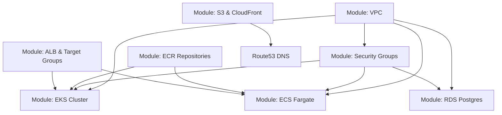

# 04. Terraform (IaC) & AWS Infrastructure Guide

This document details the Infrastructure as Code (IaC) architecture built with Terraform, AWS resource modules, and AWS CLI management commands.

---

## 4.a Terraform Modules & AWS Resource Architecture

```
terraform/
├── main.tf                  # Root module instantiating all infrastructure sub-modules
├── variables.tf             # Global input variables (region, vpc_cidr, db_password)
├── outputs.tf               # Infrastructure outputs (ALB DNS, EKS Cluster Name, S3 Bucket)
└── modules/
    ├── vpc/                 # AWS VPC, 2 Public Subnets, 2 Private Subnets, IGW, NAT Gateway
    ├── security/            # Security Groups for ALB, EKS Nodes, ECS Tasks, and RDS Postgres
    ├── database/            # AWS RDS PostgreSQL Instance (DB Subnet Group, Parameter Group)
    ├── eks/                 # AWS EKS Cluster & EKS Managed Node Group
    ├── ecs/                 # AWS ECS Fargate Cluster, Task Definitions, ECS Services
    ├── cdn/                 # AWS S3 Bucket, CloudFront Distribution, Route53 DNS Records
    └── ecr/                 # AWS ECR Repositories for 5 Microservices
```

---

## 4.b Manual Infrastructure Deployment Guide with Terraform

```bash
# 1. Navigate to terraform directory
cd terraform

# 2. Initialize Terraform modules and AWS provider plugins
terraform init

# 3. Format and validate terraform source code
terraform fmt
terraform validate

# 4. Generate and inspect execution plan
terraform plan -out=tfplan

# 5. Apply infrastructure changes
terraform apply tfplan

# 6. Destroy infrastructure (if tearing down environment)
terraform destroy -auto-approve
```

---

## 4.c AWS CLI CRUD & Troubleshooting Commands by Service

### 1. AWS VPC & Security Groups
```bash
# READ VPCs
aws ec2 describe-vpcs --filters "Name=tag:Name,Values=sunotal-vpc"

# AUTHORIZE ALB Ingress to EKS Nodes
aws ec2 authorize-security-group-ingress \
  --group-id sg-0f50d6c770735f855 \
  --protocol -1 \
  --source-group sg-049a325dedf54e9e3
```

### 2. AWS RDS PostgreSQL
```bash
# READ RDS Status & Hostname
aws rds describe-db-instances \
  --db-instance-identifier sunotal-postgres \
  --query "DBInstances[0].[DBInstanceIdentifier, Endpoint.Address, DBInstanceStatus]"

# REBOOT RDS Instance
aws rds reboot-db-instance --db-instance-identifier sunotal-postgres
```

### 3. AWS EKS Cluster
```bash
# READ EKS Status
aws eks describe-cluster --name sunotal-cluster --query "cluster.[name, status, version, endpoint]"

# UPDATE Kubeconfig
aws eks update-kubeconfig --name sunotal-cluster --region us-east-1
```

### 4. AWS Application Load Balancer & Target Groups
```bash
# LIST ALBs
aws elbv2 describe-load-balancers --names "sunotal-alb"

# READ Target Group Health
aws elbv2 describe-target-health --target-group-arn "arn:aws:elasticloadbalancing:us-east-1:143797622495:targetgroup/sunotal-auth-tg/24a0b8296cb65cd9"

# REGISTER Pod Target IP
aws elbv2 register-targets \
  --target-group-arn "arn:aws:elasticloadbalancing:us-east-1:143797622495:targetgroup/sunotal-auth-tg/24a0b8296cb65cd9" \
  --targets Id=10.10.1.127,Port=5001
```

---

## 4.d Terraform Prerequisites & Module Dependencies


