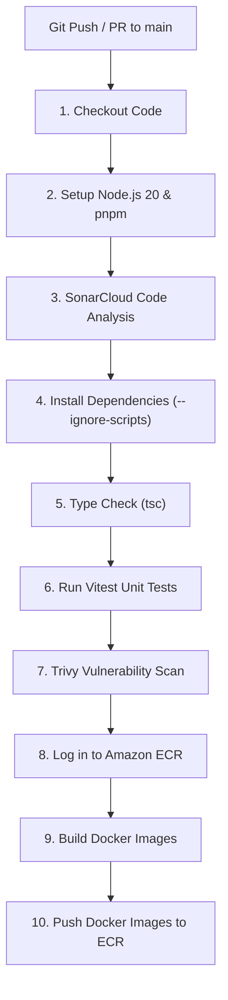
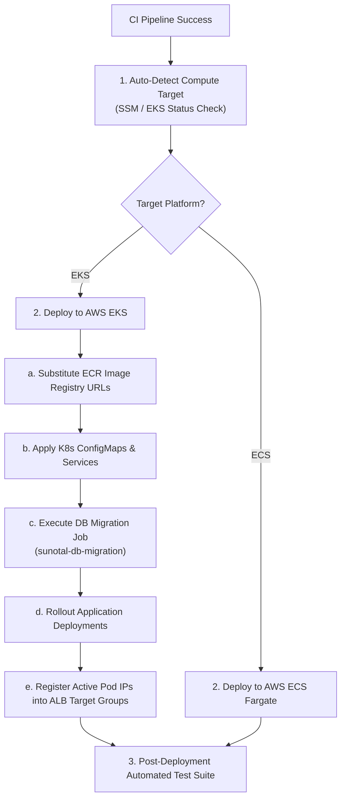

# Chapter 6: CI/CD Pipelines (GitHub Actions)

## 1. What is CI/CD?

- **Continuous Integration (CI)**: Automatically builds, lints, tests, and scans code whenever a developer pushes commits to GitHub or opens a Pull Request.
- **Continuous Deployment (CD)**: Automatically deploys the tested code to production servers (AWS EKS / ECS) as soon as CI passes on the `main` branch.

---

## 2. CI Pipeline (`.github/workflows/ci.yml`)

The CI workflow triggers on pushes and PRs targeting the `main` branch.

### Detailed CI Pipeline Steps:
1. **PostgreSQL Service Container**: Starts a temporary PostgreSQL container in GitHub Actions runner for integration testing.
2. **SonarCloud Code Analysis**: Performs static code quality and security analysis.
3. **Dependency Installation**: Runs `pnpm install --frozen-lockfile --ignore-scripts` for fast, deterministic installs.
4. **TypeScript Verification**: Runs `tsc --noEmit` on frontend and backend code.
5. **Unit Testing**: Executes Vitest suite and outputs JSON test results (`backend-report.json`, `frontend-report.json`).
6. **Trivy Vulnerability Scanner**: Scans repository filesystem for critical or high security vulnerabilities.
7. **S3 Test Report Upload**: Uploads test and vulnerability reports to S3 bucket (`s3://jcs-raju-sunotal-final/test_result/`).
8. **Amazon ECR Login & Repository Creation**: Authenticates with AWS ECR via `aws-actions/amazon-ecr-login@v2` and ensures the 6 repositories exist.
9. **Docker Image Build & Push**: Builds production Docker images for frontend, backend, and microservices, tagging them with both `:latest` and `:${{ github.sha }}` before pushing to ECR.

---

## 3. CD Pipeline (`.github/workflows/cd.yml`)

The CD workflow triggers automatically when the CI Pipeline completes successfully on `main`, or via manual trigger (`workflow_dispatch`).

### Key CD Pipeline Capabilities:

#### A. Compute Target Auto-Detection
The pipeline automatically checks AWS SSM Parameter Store (`/sunotal/compute_target`) or queries EKS cluster status (`aws eks describe-cluster --name sunotal-cluster`). If EKS is active, it deploys to EKS; otherwise, it falls back to ECS Fargate.

#### B. Dynamic ECR & Secret Substitution
Replaces place-holder image names (`sunotal-frontend:latest`) in Kubernetes manifests with exact AWS ECR registry URIs (`${ACCOUNT_ID}.dkr.ecr.us-east-1.amazonaws.com/sunotal-frontend:latest`). Dynamically discovers the active RDS database endpoint and updates `sunotal-secrets`.

#### C. Database Migration Execution
Deletes any existing migration job and applies `k8s/05-db-migration-job.yaml`. Waits up to 120s for completion. If the job fails, it automatically prints pod logs directly in GitHub Actions logs.

#### D. Dynamic Target Group Registration
Extracts live Pod IP addresses from Kubernetes (`kubectl get pods -o jsonpath='{.items[0].status.podIP}'`) and registers them directly into AWS ALB Target Groups (`sunotal-frontend-tg`, `sunotal-auth-tg`, etc.), pruning any stale dead pod IPs.

#### E. Post-Deployment Automated Test Suite
Executes 5 automated health and API checks against the live public domain (`https://sunotal.automateuniverse.space`):
- **Test 1**: Frontend Webpage HTTP 200 check (`GET /`).
- **Test 2**: Auth Service Healthz HTTP 200 check (`GET /api/healthz`).
- **Test 3**: Admin Login API check (`POST /api/auth/login`), validating JWT token generation.
- **Test 4**: Admin Dashboard Stats API check (`GET /api/admin/stats`), validating authenticated API access.
- **Test 5**: Admin Quotations API check (`GET /api/admin/quotations`), validating database read access.

---

## 4. Infrastructure Management Workflows

- **Provision Infrastructure (`infra.yml`)**: Manual trigger to run `terraform apply` and update SSM parameter target.
- **Destroy Infrastructure (`infra-destroy.yml`)**: Manual trigger with confirmation prompt to safely tear down AWS cloud resources.
