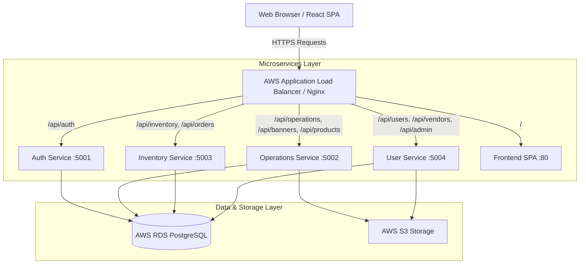
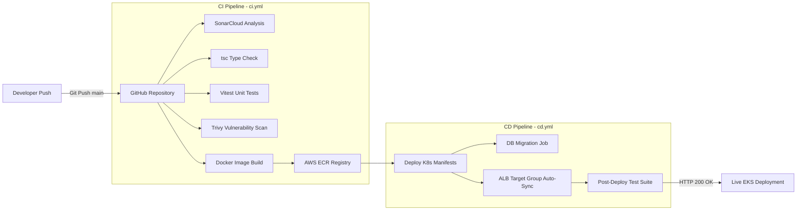
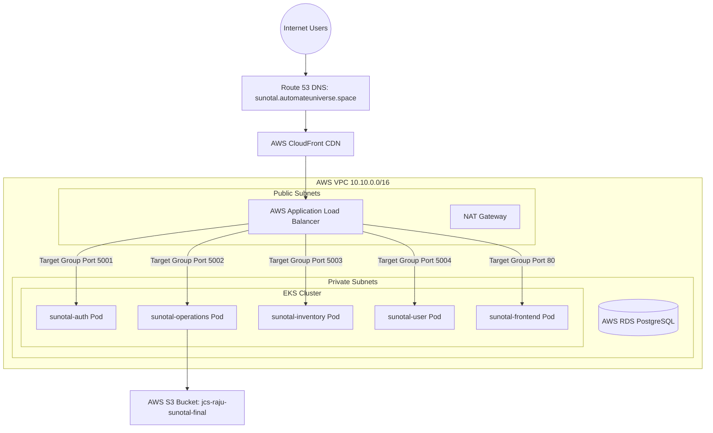
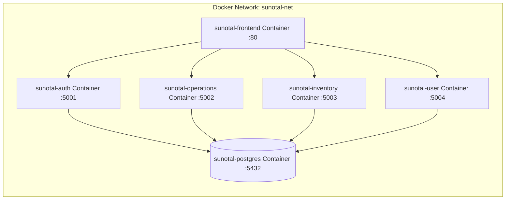
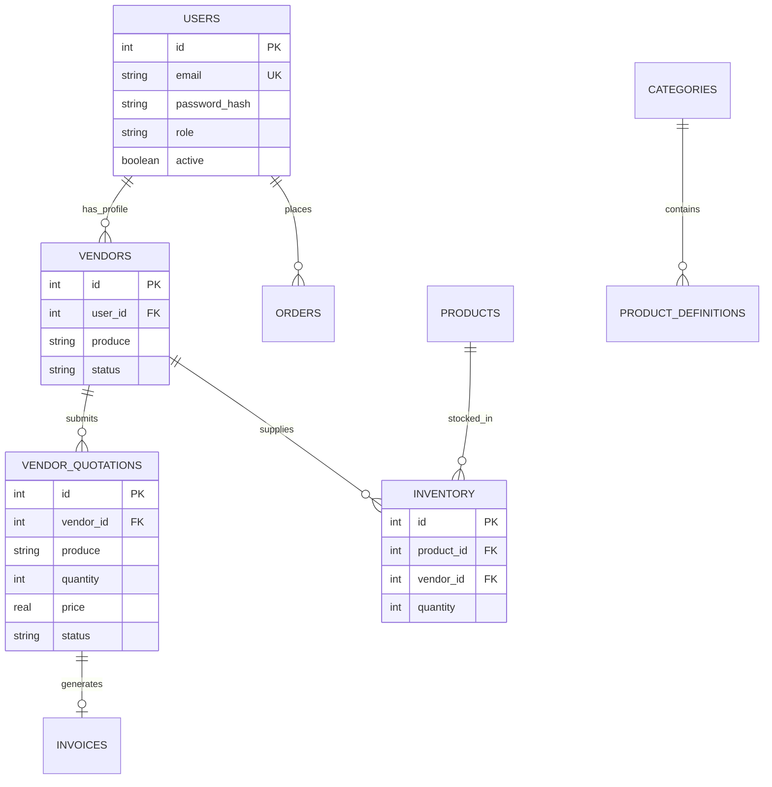
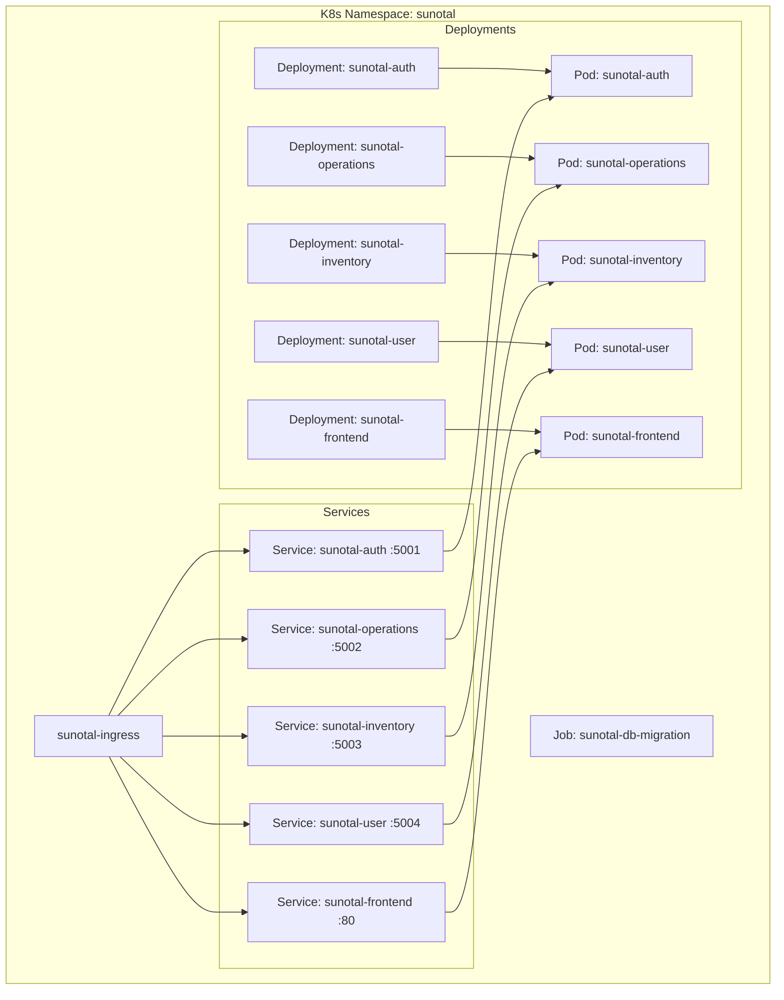

# 08. System Architectural Visualizations & Diagrams Masterclass

Welcome to the **Sunotal Architecture Visualizations Guide**. This document contains production-grade Mermaid diagrams detailing the application, DevOps, AWS cloud, Docker, database, and Kubernetes cluster architectures of Sunotal.

---

## 📖 Table of Contents
1. [Application Architecture Diagram](#1-application-architecture-diagram)
2. [DevOps Pipeline Architecture Diagram](#2-devops-pipeline-architecture-diagram)
3. [AWS Cloud Infrastructure Diagram](#3-aws-cloud-infrastructure-diagram)
4. [Docker Container Topology Diagram](#4-docker-container-topology-diagram)
5. [Database Entity-Relationship (ER) Diagram](#5-database-entity-relationship-er-diagram)
6. [Kubernetes Cluster Topology Diagram](#6-kubernetes-cluster-topology-diagram)

---

## 1. Application Architecture Diagram

---

## 2. DevOps Pipeline Architecture Diagram

---

## 3. AWS Cloud Infrastructure Diagram

---

## 4. Docker Container Topology Diagram

---

## 5. Database Entity-Relationship (ER) Diagram

---

## 6. Kubernetes Cluster Topology Diagram

