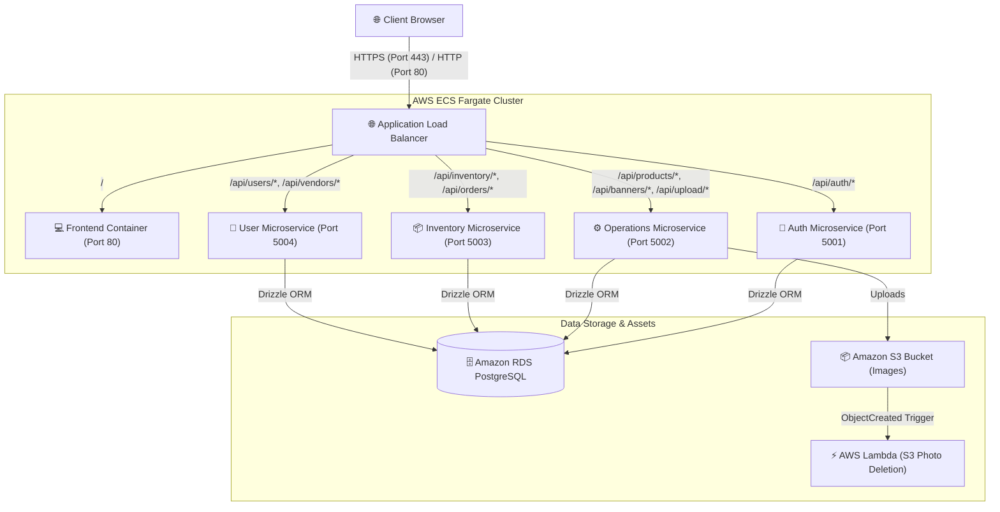

# 1. Microservices Architecture & Interactions

This document describes the microservices topology, individual service responsibilities, network ports, request routing mechanisms, and end-to-end data workflows of the Sunotal E-Commerce farm produce marketplace.

---

## 1. System Architecture Blueprint

---

## 2. Microservice Profiles

Each microservice runs in its own container as an independent AWS ECS Fargate Task, exposing specific functionalities.

| Microservice | Exposed Port | Source Directory | Primary Purpose |
| :--- | :--- | :--- | :--- |
| **Nginx Gateway** | `80` (External) | Root config | Reverse proxies incoming public requests to internal services. |
| **Frontend** | `80` (Internal) | `frontend/` | Serves the static assets of the React/Vite single page application (SPA). |
| **Auth Service** | `5001` | `backend/services/auth-service/` | Handles signup, login, session tokens verification, password hashing, and user authentication checks. |
| **Operations Service** | `5002` | `backend/services/operations-service/` | Manages product definitions, categories, product listings, banners configurations, and S3 image uploads. |
| **Inventory Service** | `5003` | `backend/services/inventory-service/` | Manages active stock levels, catalog quantities, and order placements. |
| **User Service** | `5004` | `backend/services/user-service/` | Manages user profiles, vendor profile registrations, and approval/rejection operations. |

---

## 3. End-to-End Workflows & Interactions

All microservices are stateless, utilizing the shared **RDS PostgreSQL Database** for persistent states. 

### 3.1 Scenario A: Vendor Registration and Admin Approval
1. **Application Submission**: The client uploads details to `/api/vendors/register` (routed to the **User Service**). The user account is initialized in a pending status (`active = false`).
2. **Reviewing Applications**: The administrator navigates to the admin panel, calling `/api/admin/stats` (routed to the **Operations Service**) to view pending registration metrics.
3. **Approval Action**: The admin issues a PUT request to `/api/vendors/:id/status` (routed to the **User Service**). The service updates the user status to `active = true`, enabling them to list products.

### 3.2 Scenario B: Product Upload and S3 Deletion
1. **Uploading Image**: The vendor adds a new product, uploading a crop photo to `/api/upload` (routed to the **Operations Service**).
2. **S3 Storage**: The service uploads the file to `s3://jcs-raju-sunotal-final/uploads/` and saves the file URL to RDS.
3. **Asset Deletion**: If the product is deleted, a request is sent to the **Operations Service**. The service removes the record from RDS and makes an API call triggering **AWS Lambda**, which executes the physical object deletion from S3.
