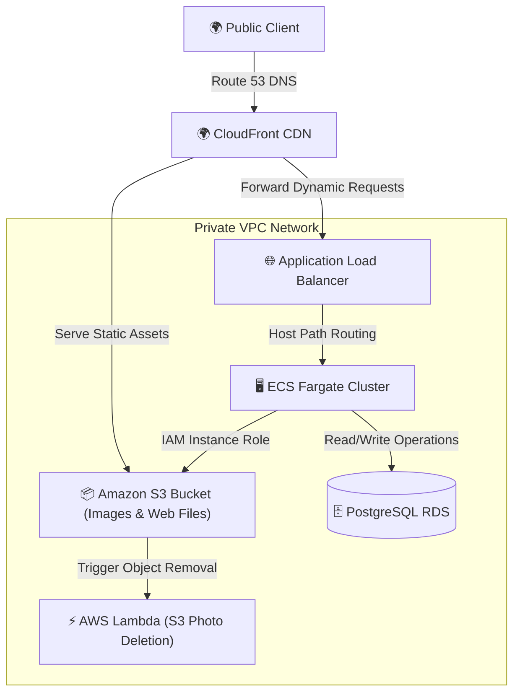

# 4. AWS Cloud Services & Command Cheat Sheet

This document outlines the AWS cloud architecture, managed services, resource associations, and essential AWS CLI operational commands for the Sunotal system.

---

## 1. AWS Cloud Services Architecture



---

## 2. Integrated AWS Services Profiles

* **Amazon VPC**: Isolated private network using public subnets (hosting the ALB and Bastion jump hosts) and private subnets (hosting the database and ECS Fargate cluster tasks).
* **Application Load Balancer (ALB)**: Listens on port `80` (HTTP) and `443` (HTTPS), decrypts SSL certificates via ACM (AWS Certificate Manager), and evaluates host/path headers to distribute requests to specific target groups.
* **Amazon ECS (Fargate)**: Serverless container engine running the application tasks. Eliminates EC2 server management, patching, and OS hardening overhead.
* **Amazon RDS (PostgreSQL)**: Fully managed relational database with automated snapshot backups, encryption-at-rest, and Multi-AZ replication options.
* **Amazon CloudFront**: Caches static assets globally at Edge Locations to reduce latency and reduce request volumes going to S3.
* **AWS Lambda**: Event-driven serverless functions (specifically `lambda_arn` module) triggering S3 asset cleaning actions when product references are deleted.

---

## 3. AWS CLI Operational workbook

These commands are used by DevOps and support teams to query, audit, and debug resources in the AWS account.

### 3.1 ECS Task Debugging & Logging
* **List Running Cluster Tasks**:
  ```bash
  aws ecs list-tasks --cluster sunotal-cluster --region us-east-1
  ```
* **Describe Task Container Health**:
  ```bash
  aws ecs describe-tasks \
    --cluster sunotal-cluster \
    --tasks <TASK_ID> \
    --query "tasks[0].containers[].{Name:name,Status:lastStatus,Reason:reason}" \
    --output table
  ```
* **Fetch Live CloudWatch Container Logs**:
  ```bash
  aws logs tail /ecs/sunotal-auth-service --follow --limit 50
  ```

### 3.2 RDS Management
* **Retrieve Active Database Host Endpoints**:
  ```bash
  aws rds describe-db-instances \
    --db-instance-identifier sunotal-postgres \
    --query "DBInstances[0].Endpoint.[Address,Port]" \
    --output text
  ```

### 3.3 S3 Assets Audits
* **Audit Storage Space Consumption**:
  ```bash
  aws s3 ls s3://jcs-raju-sunotal-final/uploads/ --recursive --human-readable --summarize
  ```
* **Recover Soft-Deleted Files (List delete markers)**:
  ```bash
  aws s3api list-object-versions \
    --bucket jcs-raju-sunotal-final \
    --query "DeleteMarkers[?IsLatest==\`true\`].[Key,VersionId]" \
    --output text
  ```
