# 5. Automation Pipelines & Workflow Topologies

This document explains the workflows, triggers, actions, and task execution logic for the continuous integration, continuous delivery, infrastructure provisioning, and decommissioning (destroy) pipelines.

---

## 1. Pipeline Automation Topologies

```mermaid
graph TD
    %% CI Flow
    subgraph "CI Pipeline (ci.yml)"
        ci_trigger["💻 Code Commit / PR"] --> ci_setup["Setup Node.js & pnpm"]
        ci_setup --> ci_install["Install Project Dependencies"]
        ci_install --> ci_lint["Run Linter & TypeScript Check"]
        ci_lint --> ci_unit_test["Execute Unit & Integration Tests"]
        ci_unit_test --> ci_sonar["Upload Reports to SonarQube"]
        ci_sonar --> ci_reports["Publish Test Reports to S3 (test_reports/)"]
    end

    %% CD Flow
    subgraph "CD Pipeline (cd.yml)"
        cd_trigger["⚙️ CI Succeeds on main"] --> cd_build["Build Production Assets"]
        cd_build --> cd_package["Compress Build Tarballs"]
        cd_package --> cd_upload["Upload Release Artifacts to S3"]
        cd_upload --> cd_ssh["SSH Connection to EC2 Target"]
        cd_ssh --> cd_deploy["Deploy App & Restart PM2 Services"]
        cd_deploy --> cd_health["Verify Application Health (ALB)"]
    end

    %% Infrastructure Flow
    subgraph "Infrastructure Pipeline (infra.yml)"
        infra_trigger["🛠️ Infra Change or Manual Run"] --> infra_ami["Build Base Machine Image with Packer"]
        infra_ami --> infra_tf["Apply Terraform Changes (Auto-Approve)"]
    end

    %% Destroy Flow
    subgraph "Destroy Pipeline (infra-destroy.yml)"
        destroy_trigger["⚠️ Manual Decommission Run"] --> destroy_tf["Terraform Destroy (Tear Down Resources)"]
    end
```

---

## 2. Pipeline Job Breakdown

### 2.1 CI Pipeline (`ci.yml`)
* **Trigger Conditions**: Every push and pull request targeted at the `main` branch containing changes inside `/backend`, `/frontend`, `package.json`, or pipeline configs.
* **Core Job Steps**:
  1. **Sonartest**: Initiates SonarQube static code scanner to evaluate security issues.
  2. **Install & Verify**: Runs `pnpm install`, checks type parameters (`tsc --noEmit`), and executes tests.
  3. **Reporting**: Test results are formatted as JSON files and uploaded to S3 (`s3://jcs-raju-sunotal-final/test_reports/<commit_sha>/`) to retain historical build verification records.

### 2.2 CD Pipeline (`cd.yml`)
* **Trigger Conditions**: Automatically runs when the **CI Pipeline** completes with a `success` conclusion on the `main` branch, or via manual trigger.
* **Core Job Steps**:
  1. **Packaging**: Compiles code production bundles and creates tarball archives (`backend-build.tgz`, `frontend-build.tgz`).
  2. **S3 Release**: Versioned tarballs are saved inside S3 under `/artifacts/latest/` and `/artifacts/${GITHUB_SHA::8}/`.
  3. **Bastion SSH Tunneling**: Configures temporary SSH keys and tunnels onto the private EC2 application server using the Bastion host as a jump box.
  4. **Live Deploy**: Downloads tarballs from S3 directly onto the EC2 instance, runs database schema migrations (`pnpm run db:push`), and triggers PM2 process reload (`pm2 restart sunotal-backend`).

### 2.3 Infrastructure Pipeline (`infra.yml`)
* **Trigger Conditions**: Changes to files in the `terraform/` or `packer/` directories.
* **Core Job Steps**:
  1. **Packer Build**: Provisions the base machine image (AMI) with Node, PM2, and Nginx preinstalled.
  2. **Terraform Validate**: Checks HCL format correctness.
  3. **Terraform Apply**: Provisions network components, security groups, RDS instances, ALB target groups, and updates the EC2 instance with the newly built AMI.

### 2.4 Infrastructure Destroy Pipeline (`infra-destroy.yml`)
* **Trigger Conditions**: Manual activation via the GitHub Actions dashboard.
* **Core Job Steps**:
  1. **Terraform Destroy**: Removes EC2 instances, target groups, RDS databases, ALBs, subnets, and routes.
  2. **DynamoDB Lock Clear**: Automatically releases any state locks to prevent locking issues on future redeployments.
