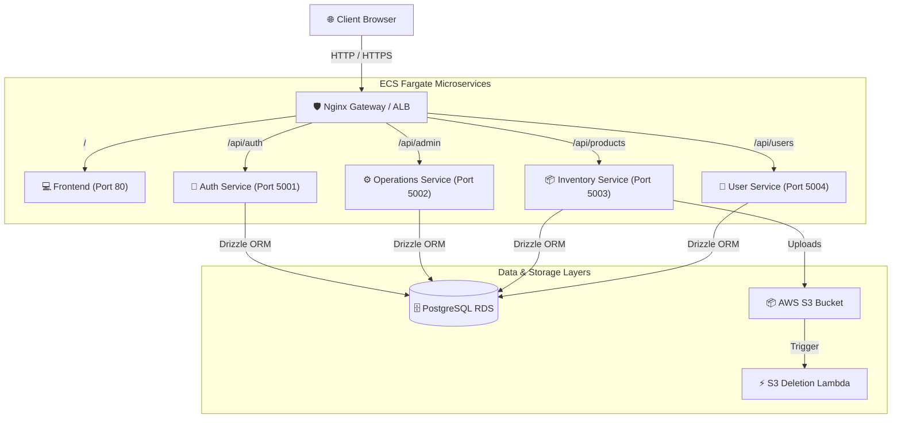
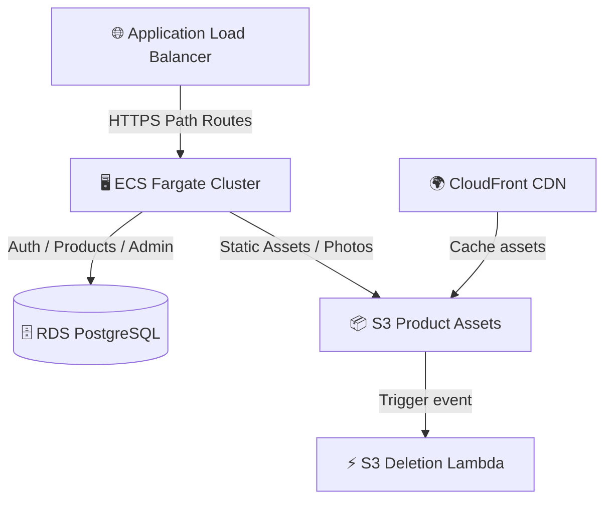
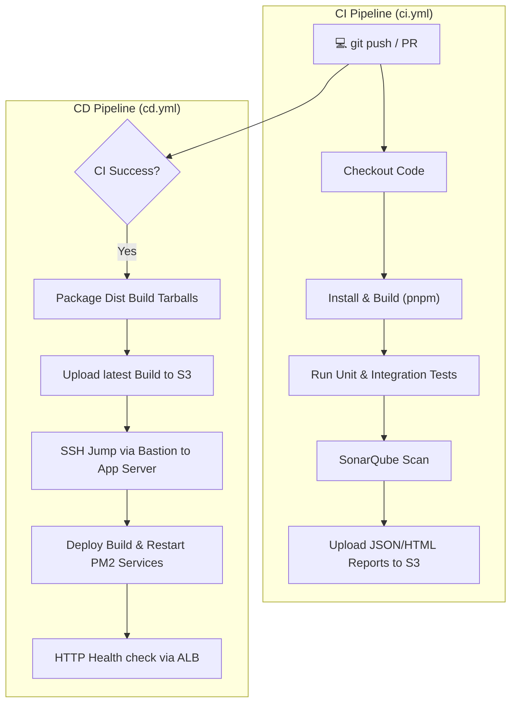

# Sunotal Microservices, Infrastructure, and Operational Runbook (KA Hub)

This document provides complete architecture diagrams, code explanations, scanning setups, pipeline details, change management procedures, and operational Knowledge Artifacts (KAs) for support and maintenance teams.

---

## 1. Microservices Architecture & Interactions

Sunotal is structured into a modular microservices architecture to ensure scalability, fault isolation, and independent deployment of key application domains.

### 1.1 Service Descriptions
* **Nginx Gateway (Proxy)**: Acts as the reverse proxy (Port 80/443), routing traffic to the frontend or specific backend microservices based on request path prefixes.
* **Frontend Service**: Serves the React/Vite web application bundle.
* **Auth Service (Port 5001)**: Handles user registration, login, JWT token issuance, session verification, and credentials processing.
* **Operations Service (Port 5002)**: Handles marketplace operations, administrative requests, admin reports, and overall dashboard calculations.
* **Inventory Service (Port 5003)**: Manages product lists, vendor category configurations, catalog updates, and order placements.
* **User Service (Port 5004)**: Manages profile updates, user/vendor profiles status (pending/approved), and general contact records.

### 1.2 Microservices Architecture Diagram



### 1.3 Interaction Workflows & API Traffic routing
All service-to-service communications are decoupled through the database layer or routed client-side via the Gateway:
1. **User Login & Session Flow**:
   * Client sends credentials to `/api/auth/login`.
   * **Auth Service** verifies credentials against the database and returns a signed JWT.
   * Client stores the JWT and attaches it to subsequent requests.
2. **Product Browsing & Admin Management**:
   * Browsing products queries `/api/products` directly to the **Inventory Service**.
   * Admin stats dashboard fetches data from `/api/admin` which queries the **Operations Service** to aggregate user signups and product definitions.

---

## 2. Infrastructure Code Documentation

### 2.1 Terraform Configuration
Sunotal's infrastructure is completely codified using Terraform in a modular layout:
* **Remote State & Locking**: State files are saved inside an S3 bucket (`jcs-raju-sunotal-final`) with state locking powered by DynamoDB (`sunotal-terraform-locks`).
* **VPC Module**: Creates a secure virtual network featuring 2 public subnets (for ALB and Bastion) and 2 private subnets (for ECS Tasks and RDS Database) across multiple Availability Zones.
* **Database Module**: Provisions an AWS RDS PostgreSQL instance in private subnets, configured with storage auto-scaling.
* **CDN/ALB Module**: Configures an Application Load Balancer with routing rules mapping path pattern headers to target groups representing each Fargate container task.
* **ECS/ECR Module**: Deploys containers on AWS ECS Fargate, pulling from the ECR registry repositories.

### 2.2 Docker Configuration
Multi-stage build Dockerfiles are utilized to minimize size and eliminate build-time dependencies from production images.

* **Backend Multi-stage Dockerfile**:
```dockerfile
# Stage 1: Build
FROM node:20-alpine AS builder
WORKDIR /app
RUN npm install -g pnpm
COPY package.json pnpm-lock.yaml ./
RUN pnpm install --frozen-lockfile
COPY . .
RUN pnpm run build

# Stage 2: Production Run
FROM node:20-alpine
WORKDIR /app
RUN npm install -g pnpm
COPY package.json pnpm-lock.yaml ./
RUN pnpm install --prod --frozen-lockfile
COPY --from=builder /app/dist ./dist
EXPOSE 5000
CMD ["node", "dist/src/index.js"]
```

---

## 3. Scanners & QA Workflows

### 3.1 SonarQube Code Quality Analysis
* **Purpose**: Performs static application security testing (SAST), detects code smells, bugs, security vulnerabilities, and monitors test coverage.
* **Trigger**: Automatically runs in the CI pipeline using `SonarSource/sonarqube-scan-action` on every pull request.
* **Configuration**: Defined in `sonar-project.properties` specifying source locations, exclusions, and project metadata.

### 3.2 Test Server Verification
* **Purpose**: Serves as a staging/pre-deployment host where the code is compiled, tested, and validated using unit and integration test blocks before shipping to production ECS tasks.
* **Integration**: CI jobs execute tests locally on runners, while the Test Server offers a sandboxed target host for running integration validation scripts.

### 3.3 Trivy Security Container Scanning
* **Purpose**: Scans Docker images for operating system package vulnerabilities, application dependencies, and misconfigurations before pushing images to ECR.
* **CI Integration Command**:
```bash
trivy image --severity HIGH,CRITICAL --exit-code 1 my-app-image:latest
```

---

## 4. AWS Services & Command Cheat Sheet

### 4.1 AWS Services Diagram



### 4.2 Essential AWS CLI Commands for Support

* **Database Connection Details**:
  ```bash
  aws rds describe-db-instances --db-instance-identifier sunotal-postgres --query "DBInstances[0].Endpoint.Address" --output text
  ```
* **Fetch Running ECS Services Status**:
  ```bash
  aws ecs list-tasks --cluster sunotal-cluster
  aws ecs describe-services --cluster sunotal-cluster --services auth-service operations-service
  ```
* **View CloudWatch Logs for Microservice Task**:
  ```bash
  aws logs tail /ecs/sunotal-auth-service --follow
  ```
* **Inspect S3 Objects**:
  ```bash
  aws s3 ls s3://jcs-raju-sunotal-final/uploads/
  ```

---

## 5. Pipeline Logic & Diagram



---

## 6. Safe Change & Enhancements Guidelines

> [!IMPORTANT]
> To prevent application regression, database locks, or pipeline failure, adhere strictly to the guidelines below.

1. **Database Schema Enhancements**:
   * Do NOT use `drizzle-kit push` directly in production.
   * Generate migrations locally using `pnpm exec drizzle-kit generate`.
   * Apply migrations to staging first, then apply to production before code deployments to avoid schema drift exceptions.
2. **Pipeline Modifications**:
   * Always test modifications on custom branches. Use `workflow_dispatch` to trigger validation runs manually before merging to `main`.
3. **Rollback Procedures**:
   * If a deploy fails, point the S3 `latest/` pointer back to the previous stable release commit-tag and re-trigger the CD deploy step to quickly restore service.

---

## 7. Knowledge Artifacts (KA) for Support & Maintenance

### 7.1 KA-01: Disk & Logs Cleanup Runbook
* **Scenario**: PM2 log files or Docker temp files consuming server disk space causing service outage.
* **Resolution Steps**:
  1. Check disk capacity: `df -h`
  2. Clear PM2 logs: `pm2 flush`
  3. Clean up dangling docker assets (if docker is used): `docker system prune -a --volumes`

### 7.2 KA-02: DB Backup & Recovery Runbook
* **Scenario**: Database backup required for maintenance window or data recovery.
* **Resolution Steps**:
  * Execute a safe backup directly from the Bastion host (which has connectivity to RDS):
    ```bash
    pg_dump -h <RDS_ENDPOINT> -U sunotal -d sunotal -F c -b -v -f /tmp/backup.dump
    aws s3 cp /tmp/backup.dump s3://jcs-raju-sunotal-final/backups/db-backup-$(date +%F).dump
    ```

### 7.3 KA-03: Quick Service Restart & PM2 Recovery
* **Scenario**: Backend service returns a 502 Bad Gateway.
* **Resolution Steps**:
  1. SSH into the private EC2 instance.
  2. Check backend list: `pm2 list`
  3. Inspect logs: `pm2 logs sunotal-backend`
  4. Restart: `pm2 restart sunotal-backend --update-env`
