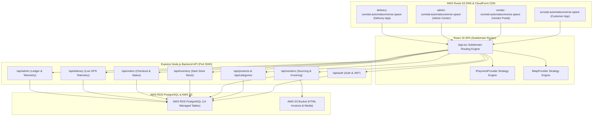

# 🏗️ Sunotal System Architecture & Specifications

Exhaustive technical specification covering subdomain DNS routing, SOLID strategy pattern design, PostgreSQL database schema specification, live Leaflet vector map tracking, and AWS cloud-native PaaS deployment architecture.

---

## 1. High-Level Subdomain & Architecture Topology

---

## 2. Complete PostgreSQL Database Schema Specification

The database consists of 14 core tables managed via Drizzle ORM:

### 1. `users`
- `id`: `serial` PRIMARY KEY
- `name`: `text` NOT NULL
- `email`: `text` UNIQUE NOT NULL
- `password_hash`: `text` NOT NULL
- `role`: `text` NOT NULL (`user`, `admin`, `vendor`, `delivery`)
- `active`: `boolean` DEFAULT `true`
- `phone`: `text`
- `city`: `text`
- `created_at`: `timestamp` DEFAULT `NOW()`

### 2. `vendors`
- `id`: `serial` PRIMARY KEY
- `user_id`: `integer` REFERENCES `users(id)` ON DELETE CASCADE
- `first_name`: `text` NOT NULL
- `last_name`: `text` NOT NULL
- `phone`: `text` NOT NULL
- `location`: `text` NOT NULL
- `produce`: `text` NOT NULL
- `email`: `text`
- `farm_size`: `text`
- `aadhar`: `text`
- `gstin`: `text`
- `status`: `text` DEFAULT `'pending'` (`pending`, `approved`, `rejected`)
- `notes`: `text`
- `created_at`: `timestamp` DEFAULT `NOW()`

### 3. `vendor_quotations`
- `id`: `serial` PRIMARY KEY
- `vendor_id`: `integer` REFERENCES `vendors(id)` ON DELETE CASCADE
- `name`: `text` NOT NULL
- `address`: `text` NOT NULL
- `phone`: `text` NOT NULL
- `email`: `text`
- `aadhar`: `text` NOT NULL
- `gstin`: `text`
- `category`: `text` NOT NULL
- `produce`: `text` NOT NULL
- `quantity`: `integer` DEFAULT `0`
- `price`: `real` DEFAULT `0`
- `status`: `text` DEFAULT `'pending'` (`pending`, `accepted`, `rejected`)
- `payment_status`: `text` DEFAULT `'unpaid'` (`unpaid`, `processing`, `paid`)
- `created_at`: `timestamp` DEFAULT `NOW()`

### 4. `invoices`
- `id`: `serial` PRIMARY KEY
- `vendor_id`: `integer` REFERENCES `vendors(id)` ON DELETE CASCADE
- `quotation_id`: `integer` REFERENCES `vendor_quotations(id)` ON DELETE CASCADE
- `invoice_number`: `text` NOT NULL
- `s3_url`: `text` NOT NULL
- `amount`: `real` NOT NULL
- `created_at`: `timestamp` DEFAULT `NOW()`

### 5. `categories`
- `id`: `serial` PRIMARY KEY
- `name`: `text` UNIQUE NOT NULL
- `icon`: `text`
- `created_at`: `timestamp` DEFAULT `NOW()`

### 6. `product_definitions`
- `id`: `serial` PRIMARY KEY
- `name`: `text` UNIQUE NOT NULL
- `category`: `text` NOT NULL
- `created_at`: `timestamp` DEFAULT `NOW()`

### 7. `products`
- `id`: `serial` PRIMARY KEY
- `name`: `text` NOT NULL
- `category`: `text` NOT NULL
- `unit`: `text` NOT NULL
- `price`: `real` NOT NULL
- `original_price`: `real` NOT NULL
- `discount_percentage`: `integer` DEFAULT `0`
- `image`: `text` NOT NULL
- `badge`: `text`
- `organic`: `boolean` DEFAULT `false`
- `active`: `boolean` DEFAULT `true`
- `description`: `text`
- `created_at`: `timestamp` DEFAULT `NOW()`

### 8. `warehouses` (Dark Stores)
- `id`: `serial` PRIMARY KEY
- `name`: `text` NOT NULL
- `city`: `text` NOT NULL
- `address`: `text` NOT NULL
- `is_active`: `boolean` DEFAULT `true`
- `created_at`: `timestamp` DEFAULT `NOW()`

### 9. `inventory`
- `id`: `serial` PRIMARY KEY
- `product_id`: `integer` REFERENCES `products(id)` ON DELETE CASCADE
- `vendor_id`: `integer` REFERENCES `vendors(id)` ON DELETE CASCADE
- `warehouse_id`: `integer` REFERENCES `warehouses(id)` ON DELETE SET NULL
- `warehouse_name`: `text`
- `quantity`: `integer` DEFAULT `0`
- `status`: `text` DEFAULT `'out_of_stock'` (`in_stock`, `low_stock`, `out_of_stock`)
- `notes`: `text`
- `created_at`: `timestamp` DEFAULT `NOW()`
- `updated_at`: `timestamp` DEFAULT `NOW()`

### 10. `orders`
- `id`: `serial` PRIMARY KEY
- `order_number`: `text` UNIQUE NOT NULL
- `user_id`: `integer` REFERENCES `users(id)` ON DELETE CASCADE
- `total_amount`: `real` NOT NULL
- `discount_amount`: `real` DEFAULT `0`
- `delivery_fee`: `real` DEFAULT `0`
- `gst_amount`: `real` DEFAULT `0`
- `final_amount`: `real` NOT NULL
- `status`: `text` DEFAULT `'processing'` (`processing`, `shipped`, `out_for_delivery`, `delivered`, `cancelled`)
- `payment_status`: `text` DEFAULT `'unpaid'` (`unpaid`, `paid`, `refunded`)
- `payment_method`: `text` DEFAULT `'card'` (`card`, `upi_qr`, `netbanking`, `cod`)
- `shipping_address`: `text` NOT NULL
- `city`: `text` NOT NULL
- `state`: `text` NOT NULL
- `pincode`: `text` NOT NULL
- `corporate_gstin`: `text`
- `corporate_po_ref`: `text`
- `tracking_number`: `text`
- `estimated_delivery`: `text`
- `created_at`: `timestamp` DEFAULT `NOW()`
- `updated_at`: `timestamp` DEFAULT `NOW()`

### 11. `order_items`
- `id`: `serial` PRIMARY KEY
- `order_id`: `integer` REFERENCES `orders(id)` ON DELETE CASCADE
- `product_id`: `integer` REFERENCES `products(id)` ON DELETE CASCADE
- `product_name`: `text` NOT NULL
- `unit_price`: `real` NOT NULL
- `quantity`: `integer` NOT NULL
- `subtotal`: `real` NOT NULL
- `created_at`: `timestamp` DEFAULT `NOW()`

---

## 3. SOLID Strategy Pattern Architecture

### A. Payment Strategy Pattern (`IPaymentProvider`)
- Contract: `frontend/src/lib/providers/payment/payment-provider.interface.ts`
- Implementations: `MockPaymentProvider`, `RazorpayPaymentProvider`, `StripePaymentProvider`
- Dynamic Factory: `getPaymentProvider()` reads `VITE_PAYMENT_PROVIDER` environment variable.

### B. Map Strategy Pattern (`IMapProvider`)
- Contract: `frontend/src/lib/providers/map/map-provider.interface.ts`
- Implementations: `CartoDBVoyagerMapProvider`, `GoogleMapsProvider`, `MapboxProvider`
- Dynamic Factory: `getMapProvider()` reads `VITE_MAP_PROVIDER` environment variable.

---

## 4. Real-Time Leaflet Live GPS Telemetry Engine

- `LiveDeliveryMapTracker.tsx` polls `GET /api/delivery/track/:orderId` every 10 seconds.
- Renders:
  1. **Dark Store Warehouse Marker** (`HUB` blue badge).
  2. **Customer Destination Marker** (`📍` emerald pin).
  3. **Live Rider Marker** (`🛵` animated amber vehicle marker).
  4. **Vector Route Polyline** connecting Warehouse ➔ Driver ➔ Customer Address.
  5. **Dynamic ETA & Speed Banner** (`ETA: 5 Mins`, `Speed: 34 km/h`, `Distance: 1.5 km`).
