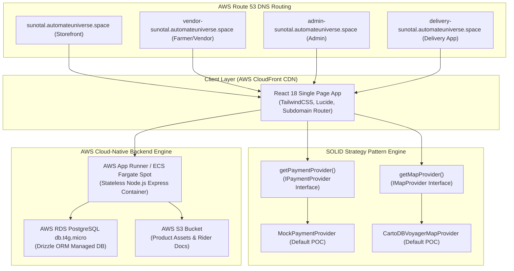

# 🏗️ Sunotal System Architecture & Technical Specifications

This document outlines the system architecture, subdomain portal routing, SOLID design patterns, database schema, and AWS PaaS deployment strategy for the Sunotal Quick-Commerce application.

---

## 1. High-Level System Topology

---

## 2. SOLID Strategy Pattern Implementations

To ensure seamless future scalability without code refactoring, high-level UI components consume interface contracts:

### A. Payment Strategy (`IPaymentProvider`)
- Contract: `frontend/src/lib/providers/payment/payment-provider.interface.ts`
- Functions: `processPayment(request)`, `verifyPayment(paymentId, orderId)`, `getSupportedMethods()`
- Dynamic Factory: `getPaymentProvider()` reads `VITE_PAYMENT_PROVIDER` env variable.
- Implementations:
  - `MockPaymentProvider` (POC default)
  - `RazorpayPaymentProvider` (Future production)
  - `StripePaymentProvider` (Future production)

### B. Mapping Strategy (`IMapProvider`)
- Contract: `frontend/src/lib/providers/map/map-provider.interface.ts`
- Functions: `loadSdk()`, `getTileUrl()`, `reverseGeocode(lat, lng)`, `searchPlaces(query)`
- Dynamic Factory: `getMapProvider()` reads `VITE_MAP_PROVIDER` env variable.
- Implementations:
  - `CartoDBVoyagerMapProvider` (POC default: High-DPI crisp vector-style tiles, zero cost)
  - `GoogleMapsProvider` (Future production)
  - `MapboxProvider` (Future production)

---

## 3. Subdomain Routing Logic

The SPA evaluates `window.location.hostname` inside `App.tsx`:
- `admin-sunotal.automateuniverse.space` ➔ Automatically maps root `/` to `AdminLogin` and `Dashboard`.
- `vendor-sunotal.automateuniverse.space` ➔ Automatically maps root `/` to `FarmerRegistration` and `VendorDashboard`.
- `delivery-sunotal.automateuniverse.space` ➔ Automatically maps root `/` to `DeliveryDashboard` and `DeliveryRegistration`.
- Main Domain ➔ Renders Consumer Grocery Storefront with 10-15 min express header.

---

## 4. AWS Free Tier PaaS Architecture

- **AWS App Runner**: Executes containerized backend code. Automatically scales to zero when idle, consuming < 180 GB-hours/month within the AWS Free Tier.
- **AWS RDS PostgreSQL (`db.t4g.micro`)**: 750 free hours/month, 20 GB SSD storage with automated daily backups.
- **AWS CloudFront + S3**: Global edge caching for static assets with 1 TB free data transfer out per month.
