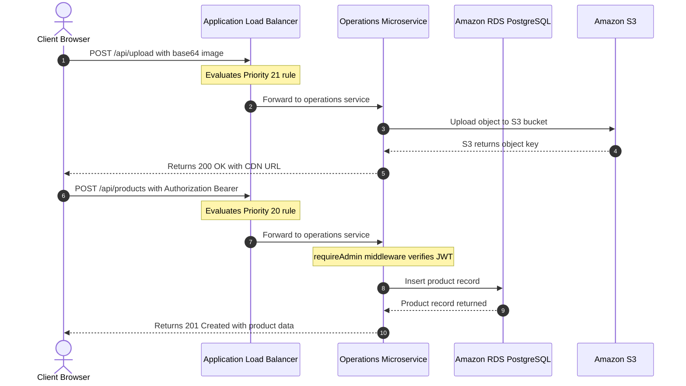

# API Routes & Cloud Runtime Behavior Catalog

This document details every REST API endpoint exposed by the **Sunotal Farms** microservices ecosystem, authentication requirements, payload formats, and their behavior in the AWS production cloud.

---

## Complete API Route Directory

### 1. Authentication & Health Endpoints (`sunotal-auth` :5001)

| Method | Endpoint | Auth | Request Body | Description |
|---|---|---|---|---|
| `GET` | `/api/healthz` | Public | None | Health check endpoint returning `{"status": "ok", "service": "auth"}`. |
| `POST` | `/api/auth/register` | Public | `{ name, email, password, phone, city }` | Creates new customer account and returns JWT token. |
| `POST` | `/api/auth/login` | Public | `{ email, password }` | Authenticates user (customer, vendor, admin) and returns JWT token. |
| `GET` | `/api/auth/me` | Bearer JWT | None | Returns profile object of the currently logged-in user. |

---

### 2. Operations & Catalog Endpoints (`sunotal-operations` :5002)

| Method | Endpoint | Auth | Request Body | Description |
|---|---|---|---|---|
| `GET` | `/api/healthz` | Public | None | Health check endpoint for operations service. |
| `GET` | `/api/products` | Public | Query: `?category=&search=&limit=&all=` | Lists active products (or all products if admin `all=true`). |
| `POST` | `/api/products` | Admin JWT | `{ name, category, unit, price, originalPrice, image, ... }` | Creates a new product in the store catalog. |
| `GET` | `/api/products/:id` | Public | None | Returns single product details by ID. |
| `PUT` | `/api/products/:id` | Admin JWT | Partial Product JSON | Updates product fields (price, stock badge, discount). |
| `DELETE` | `/api/products/:id` | Admin JWT | None | Deletes a product from the catalog. |
| `GET` | `/api/categories` | Public | None | Returns list of product categories with icons. |
| `POST` | `/api/categories` | Admin JWT | `{ name, icon }` | Creates a new category. |
| `DELETE` | `/api/categories/:id` | Admin JWT | None | Deletes a category. |
| `GET` | `/api/product-definitions` | Public | None | Returns standardized crop/produce names for vendor quotations. |
| `POST` | `/api/product-definitions` | Admin JWT | `{ name, category }` | Adds a new produce definition. |
| `DELETE` | `/api/product-definitions/:id`| Admin JWT | None | Deletes a produce definition. |
| `GET` | `/api/banners` | Public | None | Returns active marketing hero banners. |
| `POST` | `/api/banners` | Admin JWT | `{ title, subtitle, imageUrl, linkUrl }` | Creates a new hero banner. |
| `DELETE` | `/api/banners/:id` | Admin JWT | None | Deletes a hero banner. |
| `POST` | `/api/upload` | Public/Admin | `{ filename, data, folder }` | Uploads Base64 image directly to Amazon S3 bucket. |

---

### 3. Inventory & Order Endpoints (`sunotal-inventory` :5003)

| Method | Endpoint | Auth | Request Body | Description |
|---|---|---|---|---|
| `GET` | `/api/healthz` | Public | None | Public health check endpoint for ALB target group. |
| `GET` | `/api/inventory/healthz`| Public | None | Secondary public health check for CD verification. |
| `GET` | `/api/inventory` | Admin JWT | None | Lists inventory records across all products and vendors. |
| `POST` | `/api/inventory` | Admin JWT | `{ productId, vendorId, quantity, status, notes }` | Adds stock for a product from a vendor. |
| `PUT` | `/api/inventory/:id` | Admin JWT | `{ quantity, status, notes }` | Updates stock quantity and status. |
| `DELETE` | `/api/inventory/:id` | Admin JWT | None | Deletes an inventory record. |
| `POST` | `/api/orders/checkout`| Bearer JWT | `{ items: [{ productId, quantity }] }` | Deducts stock using FIFO algorithm upon checkout. |

---

### 4. User & Vendor Management Endpoints (`sunotal-user` :5004)

| Method | Endpoint | Auth | Request Body | Description |
|---|---|---|---|---|
| `GET` | `/api/healthz` | Public | None | Health check endpoint for user service. |
| `POST` | `/api/admin/login` | Public | `{ email, password }` | Dedicated administrator authentication route. |
| `GET` | `/api/admin/stats` | Admin JWT | None | Returns platform analytics (counts, category breakdown, recent activity). |
| `GET` | `/api/users` | Admin JWT | Query: `?search=` | Lists registered platform users. |
| `GET` | `/api/users/:id` | Admin JWT | None | Fetches single user record. |
| `PUT` | `/api/users/:id` | Admin JWT | Partial User JSON | Updates user details. |
| `DELETE` | `/api/users/:id` | Admin JWT | None | Deletes user account. |
| `PATCH` | `/api/users/:id/status`| Admin JWT | `{ active: boolean }` | Toggles user active state. |
| `GET` | `/api/vendors` | Public/Admin | Query: `?status=&search=` | Lists vendor profiles. |
| `POST` | `/api/vendors/register`| Public | `{ firstName, lastName, phone, location, email, password, aadhar, gstin, ... }` | Submits farmer application for approval. |
| `GET` | `/api/vendors/:id` | Public/Admin | None | Returns vendor details by ID. |
| `PUT` | `/api/vendors/:id` | Admin JWT | `{ status: "approved" \| "rejected", notes, ... }` | Approves/rejects vendor and updates linked user active state. |
| `DELETE` | `/api/vendors/:id` | Admin JWT | None | Deletes vendor profile. |
| `GET` | `/api/vendors/quotations`| Vendor JWT | None | Returns quotations submitted by the logged-in vendor. |
| `POST` | `/api/vendors/quotations`| Vendor JWT | `{ name, address, phone, email, aadhar, category, produce, quantity, price }` | Farmer submits produce price quotation. |
| `GET` | `/api/admin/quotations`| Admin JWT | None | Admin lists all vendor quotations. |
| `PUT` | `/api/admin/quotations/:id/status`| Admin JWT | `{ status: "accepted" \| "rejected" }` | Admin accepts or rejects quotation. |
| `POST` | `/api/admin/quotations/:id/invoice`| Admin JWT | `{ amount }` | Generates PDF invoice, uploads to S3, and links to quotation. |
| `PUT` | `/api/admin/quotations/:id/payout`| Admin JWT | `{ paymentStatus: "paid" }` | Marks vendor payout as complete. |
| `GET` | `/api/vendors/invoices`| Vendor JWT | None | Returns invoices for logged-in vendor. |

---

## Part 2: Cloud Runtime Request Lifecycle

