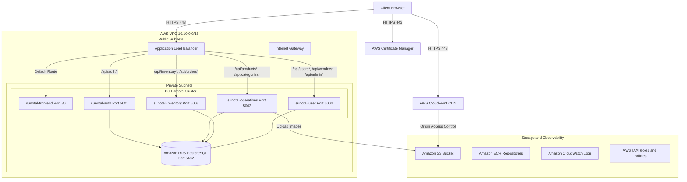

# AWS Cloud Services Tutorial & CLI Reference Manual

This guide provides a comprehensive overview of every AWS service utilized in the **Sunotal Farms** production cloud architecture, accompanied by a complete reference of all AWS CLI commands used to deploy, inspect, and troubleshoot the system.

---

## Part 1: Architecture Overview & Service Tutorials



---

### 1. Amazon VPC & Networking
- **What it is:** A Virtual Private Cloud (VPC) provides an isolated virtual network dedicated to your AWS account.
- **Sunotal Implementation:**
  - **CIDR Block:** `10.10.0.0/16`
  - **Public Subnets:** `10.10.1.0/24`, `10.10.2.0/24` (Hosts ALB and Internet Gateway for inbound HTTPS traffic).
  - **Private Subnets:** `10.10.10.0/24`, `10.10.20.0/24` (Hosts ECS Fargate containers and Amazon RDS PostgreSQL).
  - **Security Groups:**
    - `sunotal-alb-sg`: Allows inbound `80` (HTTP) and `443` (HTTPS) from `0.0.0.0/0`.
    - `sunotal-ecs-sg`: Allows inbound traffic from `sunotal-alb-sg` on application ports (`80`, `5001`, `5002`, `5003`, `5004`).
    - `sunotal-db-sg`: Allows inbound PostgreSQL port `5432` strictly from `sunotal-ecs-sg`.

---

### 2. AWS Application Load Balancer (ALB)
- **What it is:** A Layer 7 load balancer that routes incoming HTTP/HTTPS traffic across multiple target groups based on request content (path patterns, headers, methods).
- **Sunotal Implementation:**
  - Single HTTPS listener on port `443` with an ACM SSL certificate.
  - Listener Rules with priorities:
    - **Priority 10 (`sunotal-auth-tg`):** `/api/auth`, `/api/auth/*`, `/api/healthz` -> `sunotal-auth` container (:5001).
    - **Priority 20 (`sunotal-operations-tg`):** `/api/products*`, `/api/categories*`, `/api/banners` -> `sunotal-operations` container (:5002).
    - **Priority 21 (`sunotal-operations-tg`):** `/api/product-definitions*`, `/api/banners/*`, `/api/upload*` -> `sunotal-operations` container (:5002).
    - **Priority 30 (`sunotal-inventory-tg`):** `/api/inventory*`, `/api/orders*` -> `sunotal-inventory` container (:5003).
    - **Priority 40 & 41 (`sunotal-user-tg`):** `/api/users*`, `/api/vendors*`, `/api/admin*` -> `sunotal-user` container (:5004).
    - **Default Action (`sunotal-frontend-tg`):** Routes all remaining traffic (`/`, `/products`, `/admin/*`, `/vendor`, etc.) to Nginx frontend (:80).

---

### 3. Amazon ECS on AWS Fargate
- **What it is:** A fully managed container orchestration service. **AWS Fargate** is the serverless compute engine for ECS that runs containers without managing underlying EC2 virtual machines.
- **Sunotal Implementation:**
  - **Cluster:** `sunotal-cluster`
  - **5 Running Services:**
    1. `sunotal-frontend`: Serves the React Single Page Application via Nginx.
    2. `sunotal-auth`: Handles authentication, JWT issuance, `/auth/register`, `/auth/login`, `/auth/me`.
    3. `sunotal-operations`: Handles product catalog, categories, product definitions, banners, S3 image uploads.
    4. `sunotal-inventory`: Handles stock tracking and order checkout inventory deduction.
    5. `sunotal-user`: Handles user management, vendor applications, farmer quotations, invoice management, admin dashboard metrics.
  - **Auto-healing & Zero-downtime Rollouts:** Configured with minimum healthy percent `100%` and maximum percent `200%` for rolling updates.

---

### 4. Amazon RDS for PostgreSQL
- **What it is:** Relational Database Service (RDS) provides automated backups, patching, and high performance for PostgreSQL.
- **Sunotal Implementation:**
  - Single RDS PostgreSQL instance placed inside private database subnets.
  - SSL enabled (`sslmode=require&uselibpqcompat=true`).
  - Connection pooling managed via `pg.Pool` across microservices.

---

### 5. Amazon S3 & AWS CloudFront (CDN)
- **What it is:** Simple Storage Service (S3) provides scalable object storage. Amazon CloudFront is a global Content Delivery Network (CDN) that caches content close to users.
- **Sunotal Implementation:**
  - **S3 Bucket:** `jcs-raju-sunotal-final` storing product images (`images/`), banner images (`images/banners/`), and vendor invoices (`invoices/`).
  - **Origin Access Control (OAC):** Secures S3 bucket access so assets are delivered exclusively through CloudFront CDN domain `d2ncpl9skd2fp0.cloudfront.net`.

---

### 6. AWS IAM & CloudWatch Logs
- **Task Execution Role:** Grants ECS agents permission to pull Docker images from Amazon ECR and write stdout/stderr logs to CloudWatch.
- **Task Role:** Grants container applications permissions to interact directly with AWS APIs (e.g. PutObject to S3).
- **Log Groups:** `/ecs/sunotal-frontend`, `/ecs/sunotal-auth`, `/ecs/sunotal-operations`, `/ecs/sunotal-inventory`, `/ecs/sunotal-user`.

---

## Part 2: Complete AWS CLI Command Reference

### Authentication & Caller Verification
```bash
# Verify currently active AWS credentials and account
aws sts get-caller-identity
```

### ECS Cluster & Service Inspection
```bash
# List all ECS clusters
aws ecs list-clusters

# List all services in sunotal-cluster
aws ecs list-services --cluster sunotal-cluster

# Inspect detailed service status
aws ecs describe-services --cluster sunotal-cluster --services sunotal-frontend sunotal-auth sunotal-operations sunotal-inventory sunotal-user --query "services[*].[serviceName,status,runningCount,desiredCount,taskDefinition]" --output table

# Force rolling redeployment of all microservices
aws ecs update-service --cluster sunotal-cluster --service sunotal-frontend --force-new-deployment
aws ecs update-service --cluster sunotal-cluster --service sunotal-auth --force-new-deployment
aws ecs update-service --cluster sunotal-cluster --service sunotal-operations --force-new-deployment
aws ecs update-service --cluster sunotal-cluster --service sunotal-inventory --force-new-deployment
aws ecs update-service --cluster sunotal-cluster --service sunotal-user --force-new-deployment

# Wait for all services to reach steady state
aws ecs wait services-stable --cluster sunotal-cluster --services sunotal-frontend sunotal-auth sunotal-operations sunotal-inventory sunotal-user
```

### Application Load Balancer & Target Groups
```bash
# Get ALB ARN and DNS Name
aws elbv2 describe-load-balancers --names sunotal-alb --query "LoadBalancers[0].[DNSName,LoadBalancerArn]" --output table

# List all Target Groups
aws elbv2 describe-target-groups --query "TargetGroups[*].[TargetGroupName,Port,Protocol,TargetGroupArn]" --output table

# Check health of all targets across all target groups
for tg in $(aws elbv2 describe-target-groups --query "TargetGroups[*].TargetGroupArn" --output text); do
  echo "Target Group: $tg"
  aws elbv2 describe-target-health --target-group-arn "$tg" --query "TargetHealthDescriptions[*].[Target.Id,Target.Port,TargetHealth.State,TargetHealth.Reason]" --output table
done

# Describe all ALB listener rules
LISTENER_ARN=$(aws elbv2 describe-listeners --load-balancer-arn $(aws elbv2 describe-load-balancers --names sunotal-alb --query "LoadBalancers[0].LoadBalancerArn" --output text) --query "Listeners[?Port==\`443\`].ListenerArn" --output text)

aws elbv2 describe-rules --listener-arn "$LISTENER_ARN" --query "Rules[*].[Priority,Conditions[0].Values,Actions[0].TargetGroupArn]" --output table

# Modify ALB rule path patterns
aws elbv2 modify-rule \
  --rule-arn "<rule-arn>" \
  --conditions '[{"Field":"path-pattern","Values":["/api/product-definitions*","/api/productDefinitions*","/api/banners/*","/api/upload*","/api/upload"]}]'
```

### CloudWatch Logs Tailing & Debugging
```bash
# List all log groups
aws logs describe-log-groups --query "logGroups[*].logGroupName" --output table

# Tail recent logs from microservices in real time
aws logs tail "/ecs/sunotal-auth" --since 15m --follow
aws logs tail "/ecs/sunotal-operations" --since 15m --follow
aws logs tail "/ecs/sunotal-user" --since 15m --follow
aws logs tail "/ecs/sunotal-inventory" --since 15m --follow
aws logs tail "/ecs/sunotal-frontend" --since 15m --follow
```

### Amazon S3 Operations
```bash
# List S3 buckets
aws s3 ls

# List contents of the Sunotal asset bucket
aws s3 ls s3://jcs-raju-sunotal-final/images/

# Upload test file to S3
aws s3 cp sample.jpg s3://jcs-raju-sunotal-final/images/sample.jpg
```

### Amazon ECR Docker Login
```bash
# Log in Docker to Amazon ECR
aws ecr get-login-password --region us-east-1 | docker login --username AWS --password-stdin 143797622495.dkr.ecr.us-east-1.amazonaws.com
```
