# 5. Automation Pipelines & Workflow Topologies

This document explains the workflows, triggers, actions, and task execution logic for continuous integration, continuous delivery, infrastructure provisioning, and decommissioning (destroy) pipelines.

---

## 1. Pipeline Automation Topologies

```mermaid
graph TD
    subgraph CIPipeline["CI Pipeline ci.yml"]
        ci_trigger["Code Commit or PR"] --> ci_setup["Setup Node.js and pnpm"]
        ci_setup --> ci_install["Install Project Dependencies"]
        ci_install --> ci_db["Spin up PostgreSQL Service Container"]
        ci_db --> ci_test["Execute Unit and Typecheck Tests"]
        ci_test --> ci_build["Build Docker Images and Scan with Trivy"]
        ci_build --> ci_push["Push Images to Amazon ECR"]
    end

    subgraph CDPipeline["CD Pipeline cd.yml"]
        cd_trigger["CI Succeeds on main"] --> cd_update["Force New ECS Fargate Deployment"]
        cd_update --> cd_db_run["Auto-execute Startup DB Migrations"]
        cd_db_run --> cd_wait["Wait for ECS Services to be Stable"]
        cd_wait --> cd_health["HTTP health checks against ALB"]
    end

    subgraph InfraPipeline["Infrastructure Pipeline infra.yml"]
        infra_trigger["Infra Change or Manual Run"] --> infra_tf["Apply Terraform Changes"]
    end

    subgraph DestroyPipeline["Destroy Pipeline infra-destroy.yml"]
        destroy_trigger["Manual Decommission Run"] --> destroy_tf["Terraform Destroy Purge Resources"]
    end
```

---

## 2. Pipeline Job Breakdown

### 2.1 CI Pipeline (`ci.yml`)
* **Trigger Conditions**: Every push and pull request targeted at the `main` branch containing changes inside `/backend`, `/frontend`, `package.json`, or pipeline configs.
* **Core Job Steps**:
  1. **PostgreSQL Service**: Launches a live PostgreSQL database container in the runner context.
  2. **Install & Verify**: Runs `pnpm install`, checks type parameters (`tsc --noEmit`), and executes backend unit tests.
  3. **Playwright E2E Tests**: Deploys migrations/seeds onto the test database, launches the backend service in the background, and runs strict Playwright E2E browser tests to verify frontend-backend-database integration.
  4. **Docker Build & Security Gates**: Compiles Docker images for the frontend and all microservices, and runs **Trivy Vulnerability Scans** on each container. If any container contains critical vulnerabilities, the pipeline fails.
  5. **ECR Release**: Successfully scanned images are pushed to AWS ECR.

### 2.2 CD Pipeline (`cd.yml`)
* **Trigger Conditions**: Automatically runs when the **CI Pipeline** completes with a `success` conclusion on the `main` branch, or via manual trigger.
* **Core Job Steps**:
  1. **ECS Deployment**: Invokes `aws ecs update-service` to trigger rolling updates for all microservices to fetch latest ECR images.
  2. **DB Migration Tasks**: Launches serverless one-off tasks in Fargate to execute database schema syncs (`pnpm run db:push`) and seed entries (`pnpm run db:seed`).
  3. **Deployment Stability Wait**: Blocks pipeline execution using `aws ecs wait services-stable` until all rolling containers are healthy.
  4. **Strict HTTP Health Check**: Makes strict curl requests against the ALB for the frontend, auth service health endpoint, operations service `/api/products` route, and inventory service `/api/inventory` route. The build fails if any request returns non-200, protecting production from bad code updates.

### 2.3 Infrastructure Pipeline (`infra.yml`)
* **Trigger Conditions**: Changes to files in the `terraform/` directory.
* **Core Job Steps**:
  1. **Terraform Validate**: Checks HCL format correctness.
  2. **Terraform Apply**: Provisions network components, security groups, RDS databases, Application Load Balancers, and ECS tasks using cost-efficient **Fargate Spot** capacity providers.

### 2.4 Infrastructure Destroy Pipeline (`infra-destroy.yml`)
* **Trigger Conditions**: Manual activation via the GitHub Actions dashboard requiring typing "DESTROY" to confirm.
* **Core Job Steps**:
  1. **Artifact Clean**: Deletes build artifacts from S3.
  2. **Terraform Destroy**: Deconstructs all AWS-managed infrastructure. Error-silencing is disabled to prevent orphan resource leaks.

---

## 3. GitHub Actions Syntax & Keyword Documentation Reference

For a complete tabular breakdown of every YAML keyword, event trigger, service container directive, context expression, workflow command, and action plugin used across our pipelines with official documentation links, see:

👉 **[GitHub Actions CI/CD Workflows: Deep Dive & Keyword Documentation Reference](file:///home/valivarthi/DIWAKAR/PROJECTS/jcs/sunotal_fullstk/docs/github_actions_deep_dive.md)**

