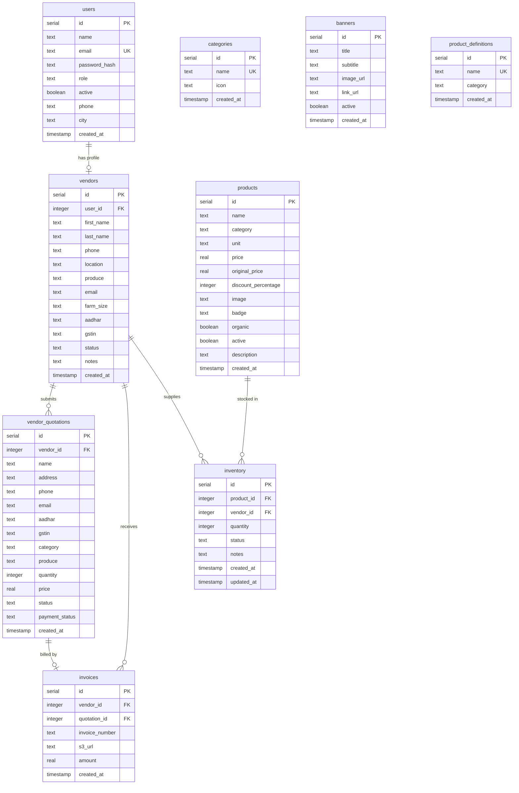

# Database Schema & Entity Relationship Diagram

This document details the database schema, table definitions, relationships, and entity interactions for the Sunotal E-Commerce platform. The database uses **PostgreSQL** managed via **Drizzle ORM**.

---

## 1. Entity Relationship Diagram (ERD)

The database includes nine tables that model users, vendors, inventory, categorizations, and invoicing processes.

---

## 2. Table Specifications

### 2.1 `users` Table
Stores basic credentials, session details, and roles for platform administrators, vendors, and end-consumers.

* **`id`** (`serial`, PK): Unique auto-incrementing identifier.
* **`name`** (`text`, Not Null): Profile display name.
* **`email`** (`text`, Not Null, Unique): Account email used for sign-in.
* **`password_hash`** (`text`, Not Null): Secure `bcryptjs` hashed string.
* **`role`** (`text`, Not Null, Default: `"user"`): System authorization role. Enum: `["user", "admin", "vendor"]`.
* **`active`** (`boolean`, Not Null, Default: `true`): Flag to suspend or activate accounts.
* **`phone`** (`text`, Nullable): Contact phone number.
* **`city`** (`text`, Nullable): Target city of operation.
* **`created_at`** (`timestamp`, Not Null, Default: `now()`): Creation record timestamp.

### 2.2 `vendors` Table
Stores administrative information, business registrations, and status validations for farmers/vendors.

* **`id`** (`serial`, PK): Unique vendor record identifier.
* **`user_id`** (`integer`, FK $\rightarrow$ `users.id`, Cascade Delete): Links vendor profile to the main user credentials.
* **`first_name`** (`text`, Not Null): Vendor first name.
* **`last_name`** (`text`, Not Null): Vendor last name.
* **`phone`** (`text`, Not Null): Contact phone number.
* **`location`** (`text`, Not Null): Farm location coordinates/address.
* **`produce`** (`text`, Not Null): Description of crop categories supplied.
* **`email`** (`text`, Nullable): Business email.
* **`farm_size`** (`text`, Nullable): Size description of farmland.
* **`aadhar`** (`text`, Nullable): Identity verification number (UIDAI).
* **`gstin`** (`text`, Nullable): Tax registration identifier.
* **`status`** (`text`, Not Null, Default: `"pending"`): Review status. Enum: `["pending", "approved", "rejected"]`.
* **`notes`** (`text`, Nullable): Internal audit notes.
* **`created_at`** (`timestamp`, Not Null): Timestamp of vendor registration.

### 2.3 `vendor_quotations` Table
Tracks price quotes and batch supply configurations proposed by active vendors.

* **`id`** (`serial`, PK): Unique quotation identifier.
* **`vendor_id`** (`integer`, Not Null, FK $\rightarrow$ `vendors.id`, Cascade Delete): Identifies the quoting vendor.
* **`name`** (`text`, Not Null): Quotation name or header.
* **`address`** / **`phone`** / **`email`**: Contact information captured at time of quote generation.
* **`aadhar`** / **`gstin`**: Vendor verification details captured at time of quote.
* **`category`** / **`produce`**: Identifies crop categorization and specifics.
* **`quantity`** (`integer`, Not Null, Default: `0`): Quantity of units offered.
* **`price`** (`real`, Not Null, Default: `0`): Target unit purchase cost.
* **`status`** (`text`, Not Null, Default: `"pending"`): Evaluation state. Enum: `["pending", "accepted", "rejected"]`.
* **`payment_status`** (`text`, Not Null, Default: `"unpaid"`): Transaction state. Enum: `["unpaid", "processing", "paid"]`.
* **`created_at`** (`timestamp`, Not Null): Quote generation time.

### 2.4 `invoices` Table
Logs financial transactions and links processed invoices with remote S3 storage URLs.

* **`id`** (`serial`, PK): Unique invoice identifier.
* **`vendor_id`** (`integer`, Not Null, FK $\rightarrow$ `vendors.id`, Cascade Delete): Recipient vendor.
* **`quotation_id`** (`integer`, Not Null, FK $\rightarrow$ `vendor_quotations.id`, Cascade Delete): Associated quotation request.
* **`invoice_number`** (`text`, Not Null): Document code.
* **`s3_url`** (`text`, Not Null): Pointer to remote PDF document hosted on S3.
* **`amount`** (`real`, Not Null): Total payment sum.
* **`created_at`** (`timestamp`, Not Null): Processing timestamp.

### 2.5 `products` Table
Primary consumer catalog entries for purchaseable farm goods.

* **`id`** (`serial`, PK): Unique catalog product identifier.
* **`name`** (`text`, Not Null): Product name (e.g., "Fresh organic Apples").
* **`category`** (`text`, Not Null): Main category assignment.
* **`unit`** (`text`, Not Null): Unit descriptor (e.g., `"kg"`, `"pack"`).
* **`price`** (`real`, Not Null): Current checkout cost.
* **`original_price`** (`real`, Not Null): Original cost before discounts.
* **`discount_percentage`** (`integer`, Not Null, Default: `0`): Computed price discount.
* **`image`** (`text`, Not Null): S3 image link.
* **`badge`** (`text`, Nullable): Promotions indicator (e.g., `"10% OFF"`, `"Trending"`).
* **`organic`** (`boolean`, Not Null, Default: `false`): Organic label flag.
* **`active`** (`boolean`, Not Null, Default: `true`): Controls catalog visibility.
* **`description`** (`text`, Nullable): Informational details.
* **`created_at`** (`timestamp`, Not Null): Time added to database.

### 2.6 `inventory` Table
Maps relationship between core catalog products and their vendor sources, along with stock count properties.

* **`id`** (`serial`, PK): Unique stock record.
* **`product_id`** (`integer`, Not Null, FK $\rightarrow$ `products.id`, Cascade Delete): Reference to catalog product.
* **`vendor_id`** (`integer`, Not Null, FK $\rightarrow$ `vendors.id`, Cascade Delete): Source supplier.
* **`quantity`** (`integer`, Not Null, Default: `0`): Available stock amount.
* **`status`** (`text`, Not Null, Default: `"out_of_stock"`): Status flag. Enum: `["in_stock", "low_stock", "out_of_stock"]`.
* **`notes`** (`text`, Nullable): Inventory comments.
* **`created_at`** / **`updated_at`** (`timestamp`): Tracking metrics for stock operations.

### 2.7 `categories` Table
Custom catalog categories.

* **`id`** (`serial`, PK): Unique category record.
* **`name`** (`text`, Not Null, Unique): Display string (e.g., `"Leafy Greens"`).
* **`icon`** (`text`, Nullable): Display icon lookup key.
* **`created_at`** (`timestamp`, Not Null): Creation timestamp.

### 2.8 `banners` Table
Promotional banners displayed on the home page.

* **`id`** (`serial`, PK): Unique banner record.
* **`title`** (`text`, Not Null): Primary headline.
* **`subtitle`** (`text`, Nullable): Secondary copy.
* **`image_url`** (`text`, Not Null): S3 banner image link.
* **`link_url`** (`text`, Nullable): Destination navigation link.
* **`active`** (`boolean`, Not Null, Default: `true`): Toggle controls visible state.
* **`created_at`** (`timestamp`, Not Null): Banner creation timestamp.

### 2.9 `product_definitions` Table
Lookup table for standardized catalog items to enforce nomenclature consistency.

* **`id`** (`serial`, PK): Unique identifier.
* **`name`** (`text`, Not Null, Unique): Predefined crop name.
* **`category`** (`text`, Not Null): Target category assignment.
* **`created_at`** (`timestamp`, Not Null): Logging timestamp.
