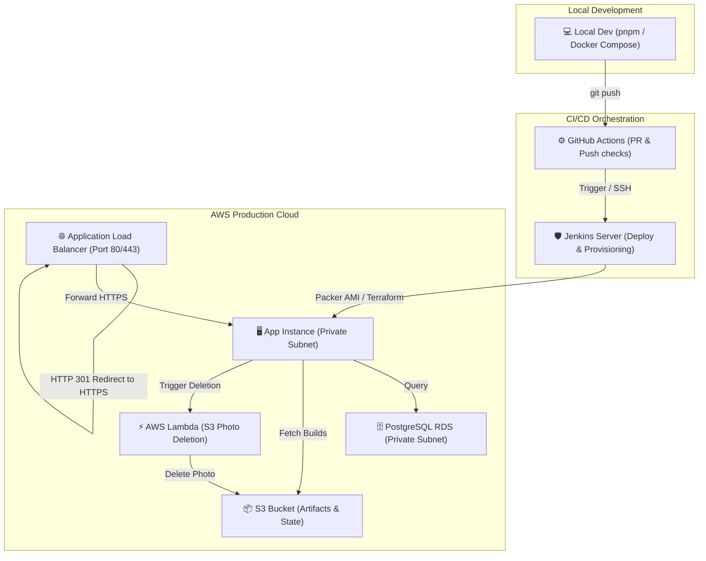

# Sunotal Comprehensive Documentation Hub

Welcome to the documentation hub for the Sunotal Corporate Fullstack E-Commerce & DevOps application.

---

## 1. Document Directory Map

We have grouped all technical guides into the `docs/` directory for streamlined reference:

- **[Installation Guide](file:///home/valivarthi/DIWAKAR/PROJECTS/jcs/sunotal_fullstk/docs/INSTALL.md)**: Steps to get the frontend, backend database, and environment variables configured locally.
- **[System Architecture Guide](file:///home/valivarthi/DIWAKAR/PROJECTS/jcs/sunotal_fullstk/docs/DOCUMENTATION.md)**: Explains the high-level application layout, Jenkins pipeline steps, and mutable vs. immutable infrastructure operations.
- **[Application Stack Tutorial](file:///home/valivarthi/DIWAKAR/PROJECTS/jcs/sunotal_fullstk/docs/app.md)**: In-depth guide to the React client, location context, stateless JWT auth token isolation, Express routes, and Drizzle/PostgreSQL schema configuration.
- **[AWS & DevOps Tutorial](file:///home/valivarthi/DIWAKAR/PROJECTS/jcs/sunotal_fullstk/docs/devops_doc.md)**: Details the Packer base AMI baking, Terraform module topology, remote state locking, ALB HTTPS routing, and AWS Lambda auto-deletion function.
- **[Enterprise DevOps Reference Guide](file:///home/valivarthi/DIWAKAR/PROJECTS/jcs/sunotal_fullstk/docs/DEVOPS_GUIDE.md)**: Advanced training manual on S3 bucket structure segregation, networking, IAM security, and troubleshooting procedures.
- **[Maintenance & Enhancements Guide](file:///home/valivarthi/DIWAKAR/PROJECTS/jcs/sunotal_fullstk/docs/maintenance_and_enhancements.md)**: Troubleshooting PM2 processes, log streams, database backups, and step-by-step instructions on implementing future code features and expanding CI/CD automation tools.

---

## 2. End-to-End System Design Overview

Sunotal leverages a modern, secure, and fully automated cloud hosting structure. Below is a high-level representation of how the application code interacts with the AWS DevOps pipelines:

For detailed specifications, follow the individual guides linked above.
