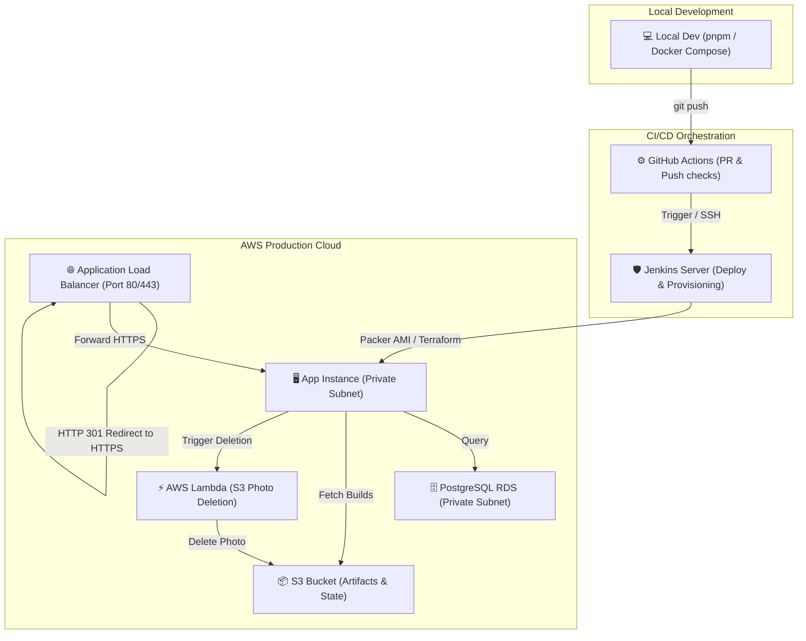

# Sunotal End-to-End System Documentation Hub

Welcome to the comprehensive documentation hub for the Sunotal E-Commerce farm produce marketplace and its AWS cloud infrastructure.

---

## 1. Structured Document Directory

For detailed step-by-step instructions on each aspect of the application, follow the structured guides below:

1. **[Local Setup & Installation](file:///home/valivarthi/DIWAKAR/PROJECTS/jcs/sunotal_fullstk/docs/1-local-setup-and-installation.md)**
   * Local dependencies, starting the PostgreSQL container, schema migrations, and initial database seeds.
2. **[Frontend Client Architecture](file:///home/valivarthi/DIWAKAR/PROJECTS/jcs/sunotal_fullstk/docs/2-frontend-architecture.md)**
   * React/TypeScript layout routing, HTML5 GPS/IP geolocation auto-detection, and session token isolation.
3. **[Backend REST API & Database Design](file:///home/valivarthi/DIWAKAR/PROJECTS/jcs/sunotal_fullstk/docs/3-backend-and-database.md)**
   * REST endpoints, token verification middleware, validation schemas, and Drizzle ORM models.
4. **[AWS Cloud Infrastructure & Terraform](file:///home/valivarthi/DIWAKAR/PROJECTS/jcs/sunotal_fullstk/docs/4-cloud-infrastructure-and-terraform.md)**
   * Private VPC subnets, remote state configurations, ALB routing rules, and HTTPS redirection.
5. **[Base Machine Image Provisioning](file:///home/valivarthi/DIWAKAR/PROJECTS/jcs/sunotal_fullstk/docs/5-packer-ansible-and-amis.md)**
   * Packer templates, Ansible playbook dependencies, OS shell hardening, Nginx proxying, and PM2 persistence.
6. **[CI/CD Pipeline Automation](file:///home/valivarthi/DIWAKAR/PROJECTS/jcs/sunotal_fullstk/docs/6-cicd-pipelines.md)**
   * Automated infrastructure workflows (Packer/Terraform) and app deployments (GitHub Actions/Jenkins).
7. **[Operational Runbook & Troubleshooting](file:///home/valivarthi/DIWAKAR/PROJECTS/jcs/sunotal_fullstk/docs/7-operations-maintenance-and-troubleshooting.md)**
   * Runtime monitoring, PM2/Nginx logs auditing, database backup/recovery scripts, SSL rotations, and error fixes.

---

## 2. End-to-End System Design Overview

Sunotal leverages a secure, modern, and fully automated cloud hosting structure. Below is the system flow mapping developer code releases to AWS production deployments:

Refer to the individual documents above to review configuration parameters, environment settings, and code details.
