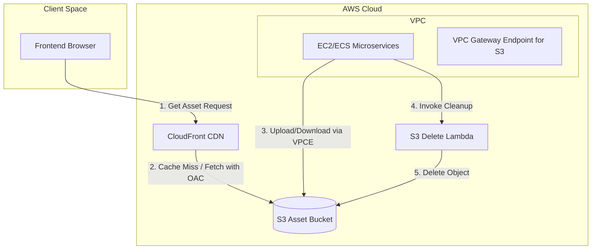

# Amazon S3 Storage Integration & Architecture

This document describes how Amazon Simple Storage Service (S3) is used, integrated, and managed in the Sunotal E-Commerce application. It covers runtime uploads/downloads, local fallbacks, infrastructure provisioning with Terraform, CDN delivery, security policies, and resource cleanup.

---

## 🏗️ Architecture Overview

The Sunotal application uses Amazon S3 as its primary object storage solution for hosting user-uploaded media (such as product and farm images) and system-generated files (such as vendor invoices).

To ensure high performance, security, and developer convenience, the S3 architecture incorporates:
1. **CloudFront CDN Integration**: Direct access to S3 objects is restricted. Instead, client traffic reads assets through a CloudFront distribution using **Origin Access Control (OAC)**.
2. **Local Fallback Storage**: If S3 is unreachable (e.g., during local development without AWS credentials or when offline), the services gracefully fallback to saving files to the local container/host filesystem.
3. **VPC Endpoint Integration**: Inside the production VPC, an S3 Gateway Endpoint is provisioned so that microservices can upload and download objects without routing traffic through the public internet.
4. **Automated Resource Cleanup**: A Python-based AWS Lambda function is configured to delete orphaned S3 objects.

---

## ⚙️ Service Integrations

### 1. Operations Service (Image Uploads)
* **File Location**: [upload.ts](file:///home/valivarthi/DIWAKAR/PROJECTS/jcs/sunotal_fullstk/backend/services/operations-service/src/routes/upload.ts)
* **Function**: Handles Base64-encoded image uploads (product assets, farm photos).
* **Key Steps**:
  1. Receives base64 image data and metadata.
  2. Generates a unique filename using timestamp and a random string.
  3. Uploads the buffer to the S3 bucket under the prefix/folder configured (defaults to `images/`).
  4. Resolves the final public URL. If `CLOUDFRONT_DOMAIN` is specified in environment variables, it creates a CDN URL (`https://<cdn-domain>/images/<filename>`); otherwise, it defaults to the S3 bucket direct URL (`https://<bucket>.s3.<region>.amazonaws.com/images/<filename>`).
  5. **Local Fallback**: If the S3 upload fails, it writes the file locally to `public/uploads/` and returns `/uploads/<filename>`.

### 2. User Service (Vendor Invoices)
* **File Location**: [vendors.ts](file:///home/valivarthi/DIWAKAR/PROJECTS/jcs/sunotal_fullstk/backend/services/user-service/src/routes/vendors.ts)
* **Function**: Generates and manages vendor invoices in HTML format.
* **Key Steps**:
  * **Upload**: When an admin generates an invoice, it's compiled into an HTML buffer and uploaded to S3 under `invoices/invoice-<quotationId>-<timestamp>.html`. If it fails, the local path is used: `public/uploads/invoices/invoice-<quotationId>.html`.
  * **Retrieval**: When fetching/viewing an invoice:
    * If the stored `s3Url` starts with `http`, the service uses the AWS SDK `GetObjectCommand` to fetch the HTML contents from S3, streaming the data back to the client.
    * If it is a local path (starts with `/uploads/`), it serves the file from the local container's disk.

---

## 🛠️ Infrastructure Provisioning (Terraform)

The S3-related infrastructure is completely defined inside the [terraform/](file:///home/valivarthi/DIWAKAR/PROJECTS/jcs/sunotal_fullstk/terraform/) directory:

### 1. S3 Bucket & Policy
* **S3 OAC Policy**: Configured in [main.tf](file:///home/valivarthi/DIWAKAR/PROJECTS/jcs/sunotal_fullstk/terraform/modules/cdn/main.tf). It defines a bucket policy allowing only the CloudFront distribution to perform `s3:GetObject` on the bucket resources.

### 2. IAM Roles & Permissions
* **EC2 Access Role**: Configured in [main.tf](file:///home/valivarthi/DIWAKAR/PROJECTS/jcs/sunotal_fullstk/terraform/modules/iam/main.tf). The instance profile provides microservices with permissions to perform:
  * `s3:GetObject`
  * `s3:PutObject`
  * `s3:DeleteObject`
  * `s3:ListBucket`
  * `lambda:InvokeFunction` (to trigger cleanup operations)

### 3. Cleanup Lambda
* **Location**: [index.py](file:///home/valivarthi/DIWAKAR/PROJECTS/jcs/sunotal_fullstk/terraform/modules/lambda/src/index.py)
* **Purpose**: A Python 3.x handler using `boto3` to receive delete events (`{ "bucket": "...", "key": "..." }`) and delete the target resource from S3.

---

## 📋 Environment Configuration Variables

Ensure the following variables are defined in the runtime environment/`docker-compose` settings:

| Variable Name | Description | Default / Example |
|---|---|---|
| `S3_BUCKET_NAME` | The target S3 bucket for storing app assets. | `jcs-raju-sunotal-final` |
| `AWS_REGION` | The AWS region where the bucket resides. | `us-east-1` |
| `CLOUDFRONT_DOMAIN` | Domain name of the CloudFront distribution (excluding `https://`). | e.g. `d111111abcdef8.cloudfront.net` |
| `AWS_ACCESS_KEY_ID` | IAM credential key (only required for local dev without IAM role). | `AKIA...` |
| `AWS_SECRET_ACCESS_KEY` | IAM credential secret (only required for local dev without IAM role). | `wJalrXUtnFEMI/K7MDENG/bPxRfiCY...` |

---

## 🔒 Security Best Practices
1. **Never Make S3 Buckets Publicly Readable**: Always block public access and serve via CloudFront with OAC/OAI.
2. **Gateway Endpoints**: VPC gateways ensure S3 traffic is kept inside AWS networks and doesn't traverse the public internet, reducing latency and costs.
3. **Local fallbacks**: Local fallback directories (`public/uploads`) should be added to `.gitignore` to prevent committing uploads into the codebase.
