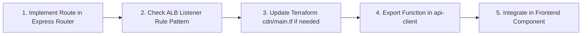

# Safe Application Enhancement Manual

This guide outlines the standard operating procedures and best practices for extending, modifying, and enhancing the **Sunotal Farms** platform safely without introducing regressions, downtime, or breaking changes in production.

---

## 1. Modifying Database Schema (Zero-Downtime Migrations)

When adding new tables, columns, or relations to PostgreSQL:

### Rules:
1. **Never drop columns or change types in a single step:** Make all new columns `NULLABLE` or provide a safe `DEFAULT` value.
2. **Update Schema Definitions:**
   - Update `schema/<entity>.ts` in both `backend/src/schema/` and `backend/services/<service>/src/schema/`.
3. **Update Auto-Migration in `initDatabase()`:**
   - Add the corresponding `ALTER TABLE <name> ADD COLUMN IF NOT EXISTS ...` or `CREATE TABLE IF NOT EXISTS` inside `src/lib/db.ts`.
   - This ensures existing live databases update seamlessly without data loss when containers boot.

---

## 2. Adding a New API Endpoint

When introducing a new backend route:



### Checklist:
1. **Express Route Definition:**
   - Create route handler in `backend/services/<service>/src/routes/<route>.ts`.
   - Ensure proper middleware is attached:
     - `requireAuth` for logged-in users/vendors.
     - `requireAdmin` for administrator actions.
     - Public routes must validate input with Zod schemas.
2. **ALB Routing Verification:**
   - Check if the new URL path matches existing ALB rules in `terraform/modules/cdn/main.tf`.
   - If introducing a new path prefix (e.g. `/api/reviews`), add the path pattern to the appropriate listener rule in `terraform/modules/cdn/main.tf` and apply via Terraform or AWS CLI.
3. **Frontend API Client:**
   - Implement typed fetch wrapper in `frontend/src/lib/api-client/<module>.ts` with TanStack Query hook (`useQuery` / `useMutation`).

---

## 3. Adding a New Frontend Page

1. **Create Page Component:**
   - Place in `frontend/src/pages/public/`, `frontend/src/pages/admin/`, or `frontend/src/pages/vendor/`.
2. **Register Route in `frontend/src/App.tsx`:**
   - Add `<Route path="/new-path" component={NewPage} />`.
3. **Role & Token Handling:**
   - If the page is under `/admin/`, wrap with `<AdminLayout>`.
   - If the page is public/consumer, wrap with `<PublicLayout>`.
   - If the page is role-protected, check `useGetCurrentUser` and redirect to `/login` if unauthorized.
4. **Resilient Data Fetching:**
   - Rely on global `throwOnError: false` in QueryClient.
   - Always handle `isLoading` with skeletons and provide empty fallback arrays (`const { data: items = [] } = useQuery(...)`).

---

## 4. Pre-Deployment Verification Checklist

Before committing and pushing to `main`:

```bash
# 1. Type check all microservices and frontend
cd frontend && pnpm exec tsc -p tsconfig.json
cd ../backend && pnpm exec tsc -p tsconfig.json
cd services/auth-service && pnpm exec tsc -p tsconfig.json
cd ../user-service && pnpm exec tsc -p tsconfig.json
cd ../operations-service && pnpm exec tsc -p tsconfig.json
cd ../inventory-service && pnpm exec tsc -p tsconfig.json

# 2. Run unit and integration tests
cd ../../backend && pnpm test
cd ../frontend && pnpm test

# 3. Build frontend bundle to verify Vite asset bundling
cd ../frontend && pnpm run build
```

Once all checks pass, commit and push to `main`. GitHub Actions CI will automatically run tests, build Docker images, push to Amazon ECR, and CD will trigger a zero-downtime rolling update on Amazon ECS Fargate.
