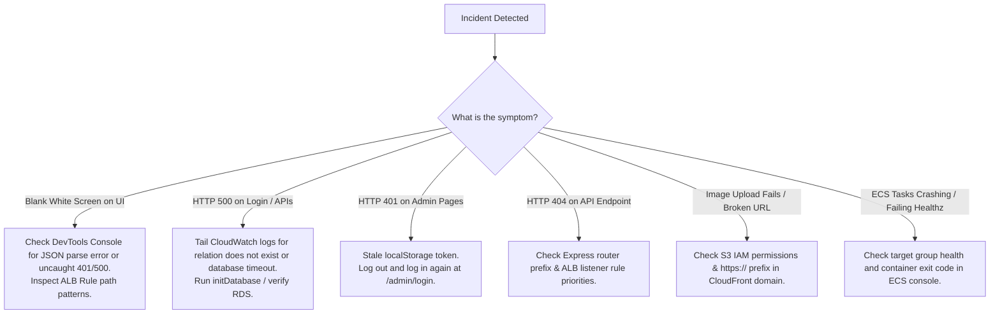

# Production Troubleshooting & Incident Remediation Manual

This manual provides an operational diagnostic checklist and step-by-step remediation procedures for diagnosing and fixing issues in the **Sunotal Farms** platform across local development, AWS Cloud infrastructure, and CI/CD pipelines.

---

## Quick Diagnostic Decision Tree



---

## Scenario 1: Blank Screen on Frontend

### Symptoms:
- Navigating to `/admin/products`, `/vendor`, or `/profile` shows an empty white screen.
- Browser DevTools Console shows: `Uncaught SyntaxError: Unexpected token '<', "<!DOCTYPE "... is not valid JSON`.

### Diagnostic Steps:
1. Open DevTools Network tab and identify which API request failed.
2. If the request returned `HTTP 200 text/html`, the ALB failed to route the API request to the backend microservice and instead fell back to the Nginx frontend container.
3. Check the ALB rules on AWS:
   ```bash
   aws elbv2 describe-rules --listener-arn <listener-arn> --output json
   ```
4. Verify if the route path pattern has trailing wildcards (`/api/product-definitions*` vs `/api/product-definitions`).

### Remediation:
- Update the ALB rule to include the wildcard pattern:
  ```bash
  aws elbv2 modify-rule --rule-arn <rule-arn> --conditions '[{"Field":"path-pattern","Values":["/api/product-definitions*","/api/productDefinitions*","/api/banners/*","/api/upload*","/api/upload"]}]'
  ```
- Update `terraform/modules/cdn/main.tf` to persist the change.

---

## Scenario 2: HTTP 500 on Login or Database Queries

### Symptoms:
- `POST /api/auth/login` or `POST /api/admin/login` returns `500 Internal Server Error`.

### Diagnostic Steps:
1. Tail the CloudWatch logs for the microservice:
   ```bash
   aws logs tail "/ecs/sunotal-user" --since 15m
   aws logs tail "/ecs/sunotal-auth" --since 15m
   ```
2. Look for PostgreSQL error codes:
   - `code: '42P01'` -> `relation "<table_name>" does not exist`.
   - `connect ETIMEDOUT` -> ECS container cannot reach RDS database security group or subnet.

### Remediation:
1. Ensure `initDatabase()` is invoked during `index.ts` startup.
2. Force a fresh rollout of the ECS services so the startup migration runs against RDS:
   ```bash
   aws ecs update-service --cluster sunotal-cluster --service sunotal-auth --force-new-deployment
   aws ecs update-service --cluster sunotal-cluster --service sunotal-user --force-new-deployment
   aws ecs update-service --cluster sunotal-cluster --service sunotal-operations --force-new-deployment
   aws ecs update-service --cluster sunotal-cluster --service sunotal-inventory --force-new-deployment
   ```

---

## Scenario 3: Broken Image Uploads

### Symptoms:
- Uploading a product image or banner succeeds with a toast, but images fail to display or appear as broken icons.

### Diagnostic Steps:
1. Right click on the broken image -> **Inspect Element**.
2. Check the `src` attribute:
   - If `src="d2ncpl9skd2fp0.cloudfront.net/images/..."` (missing `https://`), the browser will attempt to load `https://sunotal.automateuniverse.space/admin/d2ncpl9skd2fp0.cloudfront.net/...`.

### Remediation:
- Verify `backend/services/operations-service/src/routes/upload.ts` formats the URL properly:
  ```ts
  const cdnDomain = process.env.CLOUDFRONT_DOMAIN;
  if (cdnDomain) {
    imageUrl = cdnDomain.startsWith('http') ? `${cdnDomain}/${objectKey}` : `https://${cdnDomain}/${objectKey}`;
  } else {
    imageUrl = `https://${BUCKET_NAME}.s3.${REGION}.amazonaws.com/${objectKey}`;
  }
  ```

---

## Scenario 4: Target Group Target Health Unhealthy

### Symptoms:
- AWS ALB returns `502 Bad Gateway` or `503 Service Temporarily Unavailable`.

### Diagnostic Steps:
1. Check target health across all target groups:
   ```bash
   for tg in $(aws elbv2 describe-target-groups --query "TargetGroups[*].TargetGroupArn" --output text); do
     aws elbv2 describe-target-health --target-group-arn "$tg" --output table
   done
   ```
2. If `State = unhealthy`, inspect the target group health check path:
   - Must be `/api/healthz` (public endpoint returning HTTP 200).
   - If pointing to an auth-gated endpoint (like `/api/inventory`), Express returns 401, causing ALB to mark the task unhealthy.

### Remediation:
- Ensure the microservice implements an unauthenticated `/api/healthz` handler returning `{"status": "ok"}`.
